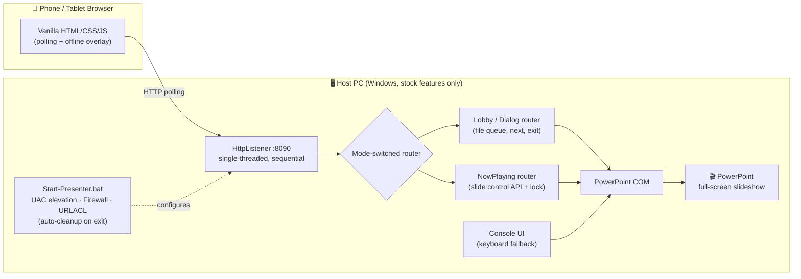
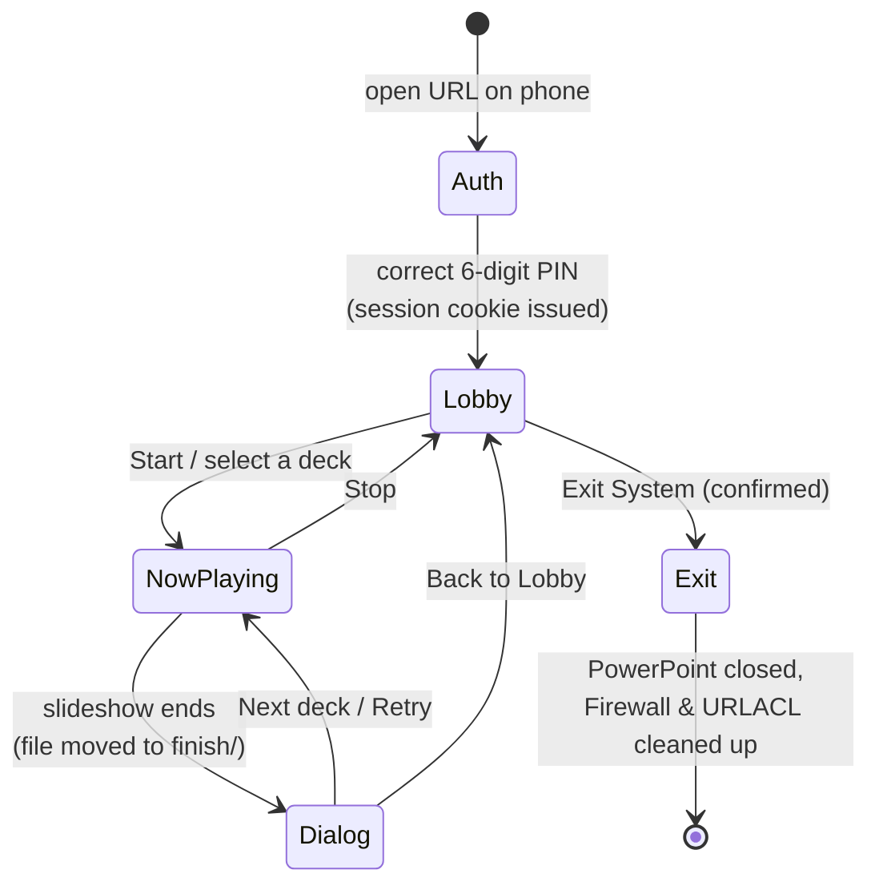
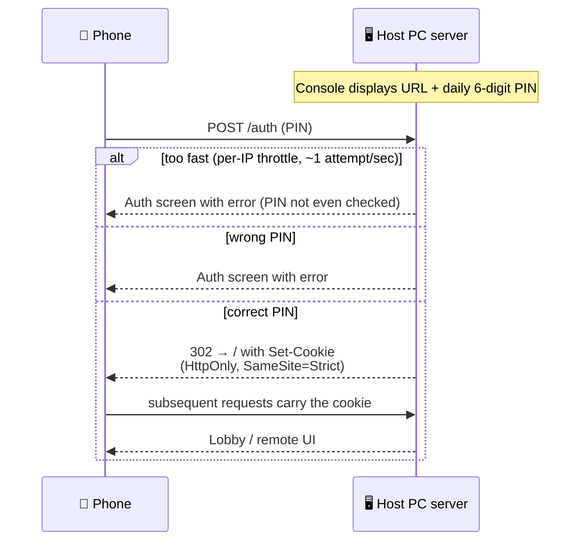

# 🎭 ppt-orchestrator

[](https://github.com/FumiakiC/ppt-orchestrator/actions/workflows/build.yml)
[](https://github.com/FumiakiC/ppt-orchestrator/releases/latest)
[](LICENSE)


> **A zero-dependency, highly robust web-based PowerPoint orchestration tool built for real-world stage managers and event staff.**

`ppt-orchestrator` enables seamless, zero-downtime transitions between multiple speakers' slide decks using just a smartphone or tablet. It requires **no third-party software installation** (like Node.js or Python) on the host PC, making it the perfect solution for strict corporate environments where installing external software is prohibited.

<!-- TODO(owner): Record demo.gif and place at docs/images/demo.gif, then uncomment.
     Storyboard (~20s, phone-view): PIN unlock → Lobby → tap Start → advance a few
     slides on the NowPlaying remote → deck ends → Dialog → tap "Next" → next deck starts.
     Capture recipe: run the server in the Windows VM, open the URL in a Mac browser
     with DevTools device emulation (~390px wide), screen-record, then convert:
       ffmpeg -i demo.mov -vf "fps=12,scale=390:-1:flags=lanczos" -loop 0 demo.gif
     Target: 12fps, width ≤ 480px, file size ≤ ~8MB.
<p align="center"></p>
-->

## 📑 Table of Contents

- [Quick Start](#-quick-start)
- [How It Works](#-how-it-works)
- [Screen Flow](#-screen-flow)
- [Key Features](#-key-features)
- [Why This Exists](#-why-this-exists-solving-real-world-challenges)
- [How to Use](#-how-to-use)
- [Advanced Operations (PC Console)](#%EF%B8%8F-advanced-operations-pc-console)
- [Troubleshooting](#-troubleshooting)
- [Security Best Practices](#%EF%B8%8F-security-best-practices-operational-guidelines)
- [For Developers](#-for-developers)

---

## 🚀 Quick Start

**No build step required.** Every release ships a ready-to-run package:

1. **[⬇️ Download `ppt-orchestrator-ready-to-use.zip` from the latest release](https://github.com/FumiakiC/ppt-orchestrator/releases/latest)**
2. Extract it to a folder **only the administrator can write to** (e.g., the admin's Desktop — see [Security Best Practices](#%EF%B8%8F-security-best-practices-operational-guidelines)).
3. Drop your `.ppt` / `.pptx` files next to `Start-Presenter.bat`.
4. Double-click `Start-Presenter.bat`, then open the displayed URL on your phone and enter the PIN.

That's it — the batch file handles Administrator elevation, Firewall rules, and URL reservations automatically, and cleans them all up on exit.

> 🛠️ Building from source instead? See [For Developers](#-for-developers).

---

## 🧩 How It Works

Everything runs on **stock Windows features only**: PowerShell 5.1, the built-in .NET `HttpListener`, and PowerPoint's COM interface. Your phone talks to a tiny single-threaded web server on the host PC — no cloud, no runtime, no install.



Key robustness choices baked into this design:

- **Single-threaded, sequential HTTP** — never races with PowerPoint's COM (STA) model.
- **Client disconnects are swallowed** — a phone going to sleep or Wi-Fi dropping can *never* crash the projection; the web UI auto-reconnects via an offline overlay.
- **Transient COM errors are classified by HResult** — "PowerPoint is busy" is treated as *keep projecting*, not *fail*.

## 🔀 Screen Flow



And the authentication handshake — one PIN entry per device per day, then a cookie session takes over:



---

## ✨ Key Features

- **📱 Mobile Web Remote:** Control presentations directly from your phone's browser.
- **🔐 Secure PIN Authentication:** A 6-digit PIN (rejection-sampled, generated per day) unlocks the remote, then an HttpOnly / SameSite=Strict session cookie keeps authenticated devices signed in.
- **🔄 Seamless Transitions:** Instant, full-screen switching between `.ppt` / `.pptx` files — the audience never sees your desktop.
- **🗂️ Auto-Queue & Pagination:** Automatically sorts files into "Pending" and "Completed" lists. Supports pagination for large-scale events with many speakers.
- **🎚️ In-Slideshow Remote with Operation Lock:** Next / previous / first / last / blackout / whiteout during playback, guarded by a per-device operation lock (auto-released after 15 s of inactivity) so two operators can't fight over the slides.
- **📶 Network-Drop Resilient:** Polling architecture with an auto-reconnecting offline overlay; broken connections are ignored server-side and the show goes on.
- **🛡️ Auto-Configuration & Cleanup:** The included Batch file automatically handles Administrator elevation, Windows Firewall rules, and URLACL bindings — and cleanly removes them upon exit.

<!-- TODO(owner): Record the two feature GIFs below, place under docs/images/, then uncomment.
     remote.gif (~10s, phone-view): NowPlaying remote — next/prev taps, a long-press guard
       in action, blackout/whiteout toggle, and the operation-lock indicator.
     resilience.gif (~12s, phone-view): turn Wi-Fi off → offline overlay appears →
       turn Wi-Fi back on → UI auto-reconnects. Caption sells the point: the projection
       on the PC never stopped.
     Same capture recipe as demo.gif (ffmpeg, 12fps, width ≤ 480px, ≤ ~8MB each).
<table>
  <tr>
    <td align="center" width="50%">
      <br/>
      <b>🎚️ Live remote with operation lock</b>
    </td>
    <td align="center" width="50%">
      <br/>
      <b>📶 Wi-Fi drops? The show goes on</b>
    </td>
  </tr>
</table>
-->

---

## 💡 Why This Exists (Solving Real-World Challenges)

Running a multi-speaker event often comes with severe operational headaches. This tool was engineered specifically to solve them:

| 😱 Real-world problem | ✅ How ppt-orchestrator solves it |
|---|---|
| 🚫 **Corporate PCs block third-party installs** | Built entirely on native Windows tools (PowerShell & Batch). If you have Windows and PowerPoint, it just works. |
| 📶 **Venue Wi-Fi drops, phones go to sleep** | Robust polling architecture; the server safely ignores broken pipes, and the web UI auto-reconnects. The presentation *never* crashes due to a network drop. |
| 🔒 **Anyone on the venue Wi-Fi could find the remote** | Built-in PIN authentication — a 6-digit PIN shown only on the host PC gates every control. |
| 📺 **Dragging windows in front of the audience** | Frictionless switching: launch the next deck with a single tap, no desktop navigation. |
| ⚠️ **Misclicks under pressure** | Disabled console close button, Y/N exit confirmations, long-press guards on destructive actions, and finished decks auto-moved to `finish/` so no one replays the wrong file. |

<details>
<summary>📖 <b>The story behind the tool</b></summary>

<br/>

I created `ppt-orchestrator` out of pure frustration with how presentation events are typically handled at companies and schools. Time and again, I witnessed events delayed or derailed by clumsy slide transitions, accidental misclicks, and technical hiccups.

Worse yet, simply because I was "the guy who knows a bit about computers," I was constantly appointed as the designated slide-switcher. It was a tedious and stressful role where a single misclick could launch the wrong presentation and cause frustrating delays to the entire event schedule.

I wanted to solve this problem once and for all and automate myself out of that stressful job. My absolute non-negotiable requirement for this project was that **the solution had to be completely self-contained using only standard Windows features**. It had to be strictly "zero-dependency" with absolutely no additional installations required, ensuring it could be instantly deployed on any heavily restricted corporate PC.

</details>

---

## 🚀 How to Use

### Prerequisites

1. A Windows PC with **Microsoft PowerPoint** installed.
2. The PC and your mobile device must be on the **same network** (Wi-Fi or LAN).

### Step-by-Step Guide

1. **Prepare the Files**
   Place all your `.ppt` or `.pptx` files in the folder containing `Start-Presenter.bat`. *(Tip: prefix file names with numbers like `01_...`, `02_...` for guaranteed order.)*
2. **Launch the Server**
   Double-click `Start-Presenter.bat`.
   *Note: it will prompt for Administrator privileges (UAC). This is required to temporarily configure the Windows Firewall and `http.sys` to allow web traffic.*
3. **Connect & Authenticate**
   The PC console will display a **Web URL** (e.g., `http://192.168.x.x:8090/`) and a **6-digit PIN CODE**. Open the URL on your smartphone and enter the PIN to unlock the remote.
4. **Control the Show**
   - **Lobby Screen:** Select a specific file from the queue or simply press **"Start"**.
   - **Now Presenting:** The slide opens full-screen on the PC. From your phone you can advance/rewind slides, black/white-out the screen, and monitor elapsed time.
   - **Post-Presentation:** When a deck ends, the file is moved to the `finish/` folder. Your phone prompts you to start the **Next** deck, **Retry**, or return to the **Lobby**.
5. **Clean Shutdown**
   Tap **"Exit System"** on your mobile device, or press `Q` in the PC console (requires `Y` confirmation). The script safely closes PowerPoint and cleans up all temporary Firewall and network rules.

<details>
<summary>📂 <b>Directory structure</b> (what goes where)</summary>

```text
ppt-orchestrator/
│
├── Start-Presenter.bat              # 🚀 The Launcher (Handles Elevation & Network config)
├── README.md                        # 📖 Documentation
│
├── 01_Opening_Remarks.pptx          # ⬅️ Drop your presentation files here
├── 02_Keynote_Speech.pptx           # ⬅️ (Files are sorted alphabetically)
│
├── dist/
│   └── presentation-controller.ps1  # ⚙️ The deployable script (included in the release ZIP,
│                                     #    or generated by build/build.ps1 from source)
│
├── finish/                          # 📁 Auto-generated at runtime
│   └── 00_Test_Slide.pptx           # ⬅️ Finished presentations are moved here
│
│  ── The folders below exist in the source repository only ──
│
├── src/                             # 📦 Modular source files
│   ├── config.ps1                   #    Parameters & script-scope variables
│   ├── templates.ps1                #    HTML/CSS/JS templates
│   ├── utils.ps1                    #    Utility functions
│   ├── auth.ps1                     #    PIN authentication
│   ├── server.ps1                   #    HTTP request routing
│   ├── ui-console.ps1               #    Console UI & keyboard input
│   ├── com-handler.ps1              #    PowerPoint COM monitoring
│   ├── main.ps1                     #    Entry point (dot-sources all modules)
│   └── frontend/                    #    Views (.html), main.css, polling/remote/hold .js
│
├── docs/                            # 📚 AI context, characterization spec, API spec, plans
├── tests/                           # ✅ Dependency-free characterization tests (run-tests.ps1)
└── build/
    └── build.ps1                    # 🔨 Combines src/ into the single deployable script
```

</details>

---

## 🛠️ Advanced Operations (PC Console)

If the Wi-Fi completely fails and you lose access to the web remote, the host PC operator can still fully control the flow using the keyboard in the console window:

| Key | Action |
|---|---|
| `Enter` / `S` | Start / Next slide deck |
| `1` – `9` | Jump to a specific file on the current queue page |
| `N` / `P` | Next page / Previous page (when handling many files) |
| `U` | Update network info (re-fetches IP addresses) |
| `R` | Retry the current deck |
| `L` | Back to Lobby |
| `Q` / `ESC` | Initiate safe system shutdown (prompts for `Y/N` confirmation) |

---

## ❓ Troubleshooting

<details>
<summary><b>The web page isn't loading on my phone.</b></summary>

<br/>

Ensure your phone and the host PC are connected to the exact same Wi-Fi network. If the network changes, press `U` on the PC console to refresh the displayed IP addresses.

</details>

<details>
<summary><b>I get a "Port in use" error.</b></summary>

<br/>

Port `8090` might be used by another application. You can change the port by editing `set "WEB_PORT=8090"` in the `.bat` file and `[int]$WebPort = 8090` in the `.ps1` file.

</details>

<details>
<summary><b>Does it support clickers / presentation remotes?</b></summary>

<br/>

Yes! The speaker can use a standard USB clicker to advance their slides while they are speaking. `ppt-orchestrator` simply manages the "switching" between files behind the scenes.

</details>

---

## ⚠️ Security Best Practices (Operational Guidelines)

This tool is designed for ease of deployment and runs over **HTTP (not HTTPS)**. To reduce real-world exposure without requiring a TLS setup, please follow the guidelines below.

### 🔓 Risk: Network Eavesdropping (Unencrypted HTTP Traffic)

Because no TLS encryption is used, the PIN code and session tokens are transmitted in plain text. On an open venue Wi-Fi network (e.g., a public conference hall), anyone on the same network could potentially intercept them.

**Mitigation:** Always operate this tool on a **dedicated, password-protected local network** — for example, a mobile Wi-Fi router or personal hotspot accessible only to event staff. Never run it over a public or shared venue Wi-Fi.

### 🔑 Risk: Privilege Escalation via Script Tampering

`Start-Presenter.bat` requests Administrator privileges (UAC) at launch. If the script files reside in a location where unprivileged users have write access (e.g., a shared network drive or `C:\Users\Public`), a malicious actor could replace them before execution — causing arbitrary code to run with Administrator rights.

**Mitigation:** Extract and run the tool only from a location accessible **exclusively to the administrator**, such as the Desktop or Documents folder of the admin account. Never place the files in a world-writable shared directory.

---

## 🧑‍💻 For Developers

Want to build from source or contribute?

```powershell
git clone https://github.com/FumiakiC/ppt-orchestrator
cd ppt-orchestrator

# Build src/ into the single deployable script (dist/presentation-controller.ps1)
pwsh -NoProfile -File ./build/build.ps1 -Version dev

# Run the dependency-free characterization tests
pwsh -NoProfile -File ./tests/run-tests.ps1
```

- `src/` is modular for development; `build/build.ps1` fuses it into one self-contained script — the product itself stays strictly **zero-dependency** (no external modules, frameworks, or runtimes).
- HTTP behavior is documented as a characterization spec in [`docs/04_api_spec.md`](docs/04_api_spec.md).
- CI builds, guards, and tests every PR; a push/merge to `main` automatically versions and publishes a GitHub Release with the ready-to-use ZIP.

## 📄 License

[MIT](LICENSE) © FumiakiC