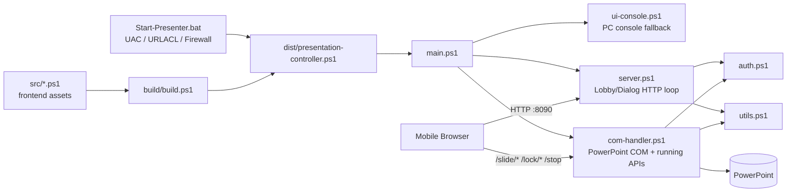

# ppt-orchestrator リファクタリング・堅牢化 最終計画書

作成日: 2026-06-30  
改訂日: 2026-07-19（改訂 8）  
対象: `ppt-orchestrator` @ `9faa870`  
Generated by: Sakana Fugu Ultra  
Reviewed by: Claude（全指摘をソースコードと静的突合済み）  

> 本書は、`README.md` と実装一式を確認したうえで作成した、今後の改良・リファクタリング・堅牢化のための最終計画書です。  
> この作業では製品コードは変更していません。計画書のみを作成・整理しています。  
> 調査環境は macOS のため、PowerPoint COM / Windows `HttpListener` / Console / `.bat` / Firewall / URLACL の実挙動は未検証です。これらに触れる変更は、CI に加えて Windows 実機スモークを必須ゲートにします。
>
> **改訂 1（2026-07-02）**: 本書の全指摘事項を HEAD (`9faa870`) のソースコードと突合し、事実確認を実施した。主な変更点:
> - 「可能性がある」と記載されていた **未認証 `GET /auth` の情報露出を確定挙動として確認**（Lobby / NowPlaying 両ループで再現）。
> - `/stop` の権限モデル（owner チェックなし）を実装箇所付きで確定。
> - PIN brute force リスクを定量化（試行レートと成功確率の概算を追記）。
> - `.bat` 末尾のゴミは「``` 行」ではなく **バッククォート 2 文字（改行なし）** に事実修正。
> - 新規指摘: `src/*.ps1` の BOM / 改行コード不統一（実行時無害だが直接実行と diff 衛生に影響）。
> - §12 の `docs/` Git 管理に関する不確実点は、コミット `76ef4d8` で解消済みのため更新。
>
> **改訂 2（2026-07-12）**: PR-A（#27）が main に squash merge され、`v1.1.20` として自動リリースされた後、計画書の誤記と Phase 0 の扱いを更新した。主な変更点:
> - §10-12 の期待値は誤りだった。`Move-ToFinishIfPending` は `Move-Item -Force` を使っており、同名 collision では既存ファイルが上書きされる。「消さない」は PR-F 完了後の期待値であり、現時点のスモーク期待値ではない。現状挙動として書き直した。
> - §10-18 も不正確だった。`ui-console.ps1` は PIN を Console に表示するのが仕様であり、秘匿対象は token / Cookie。
> - Phase 0 の作業 6（ログ / security header / token 方針の docs 化）は仕様判断そのものであるため、Phase 2 / 2.5 へ移管した（docs 追従 PR に未決の設計判断を混ぜないため）。
> - Phase 0 の作業 7（`.gitattributes` / `.editorconfig`）は全行 diff を生みレビュー不能になるため、独立した chore PR に分離した。
> - スモーク手順は `docs/05_windows_smoke_checklist.md` に実行版として切り出した。§10 はサマリであり、実行時は `docs/05` を正とする。
>
> **改訂 3（2026-07-12）**: chore PR（#29）が main に squash merge され、`v1.1.22` として自動リリースされた後、Phase 0 の完了反映と新規指摘の取り込みを行った。主な変更点:
> - Phase 0 作業 7（`.gitattributes` / `.editorconfig`）を完了として記録した。BOM は `src/*.ps1` だけでなく `build/build.ps1` と `tests/*.ps1` を含む全 `*.ps1`（12 ファイル）に付与し、blob は LF 正規化・作業ツリーは `*.ps1` / `*.bat` のみ CRLF 固定とした。
> - §5 の事実誤認を修正した。BOM なし + LF だったのは `com-handler.ps1` と `ui-console.ps1` の 2 ファイルではなく、**`templates.ps1` を含む 3 ファイル**だった（`templates.ps1` は純 ASCII のため文字化けの実害はなかった）。
> - 挙動不変を定量的に確認した。`dist` の CRLF 数は 845 → 1566 に変化したが、改行・BOM を正規化した文字列比較（`-ceq`）で main の `dist` と完全一致。build は `UTF8Encoding($true)` で `dist` を書くため、src 側 BOM は `Get-Content -Encoding UTF8` で除去され `dist` に混入しない（v1.1.21 リリース資産の実測でも U+FEFF は先頭 1 個のみ）。
> - 新規指摘: パス系 API の `-Path` / `-LiteralPath` 不統一。`src` 全体では `-LiteralPath` が **11 箇所**（`config.ps1` 9 / `utils.ps1` 2）で使われている一方、`main.ps1:40` と `main.ps1:42` の `Test-Path` だけがこれを欠く外れ値。角括弧 `[` `]` を含むフォルダ名で実在パスを誤判定し得る。なお `main.ps1:42` の `New-Item` には `-LiteralPath` が存在しないため、`[WildcardPattern]::Escape()` 等の別手段が要る。Phase 5 へ追加した。
>
> **改訂 4（2026-07-13）**: PR-B（#32）が main に squash merge され、`v1.1.25` として自動リリースされた後、Phase 0 / Phase 6 の進捗を反映した。主な変更点:
> - Phase 0 作業 5（`.bat` 末尾の不要なバッククォート 2 文字削除）と Phase 6 作業 1（`whoami /upn` 抽出ロジック修正）を完了として記録した。
> - Phase 0 は、Phase 2 / 2.5 へ移管済みの作業 6 を除き完了した。
> - `tests/launcher.tests.ps1`（`.bat` の内容ベース回帰ガード 4 件）が追加され、現行のテスト基準値は `PASS 33 / FAIL 0 / PENDING 10` になった。PENDING の内訳は `golden.route.tests.ps1` の 10 件で不変。
> - ドメイン / Entra 参加機では、URLACL 登録ユーザーが従来の `DOMAIN\USER` から UPN 形式に変わる挙動変更が入った。
>
> **改訂 5（2026-07-15）**: PR-C（#33）が main に squash merge され、`v1.1.27` として自動リリースされた後、Phase 1 の進捗と新規指摘の取り込みを行った。主な変更点:
> - Phase 1 作業（`Resolve-Route` の純粋関数抽出 + `golden.route.tests.ps1` の PENDING 10 件有効化）を完了として記録した。ルート分類は `src/utils.ps1` の `Resolve-Route` に集約され、`com-handler.ps1` の dispatch は `switch ($route.Kind)` 化された（`/stop` は switch 内 break が while を抜けない PowerShell 仕様のため flag 方式で回避）。
> - route の characterization（[F]）が pending から結線済み・有効になり、現行のテスト基準値は `PASS 57 / FAIL 0 / PENDING 0` になった。
> - Gemini レビューで指摘された パス正規化の `ToLower()` のカルチャ依存（Turkish-I 問題）を Phase 2 の作業 10 として追加した。挙動不変の refactor である PR-C 本体には含めず、入口の `Url.LocalPath.ToLower()`（`src/com-handler.ps1` / `src/server.ps1`）と `Resolve-Route` 内の `$Path.ToLower()` を含む 3 箇所の一括対応として Phase 2 へ送った。
>
> **改訂 6（2026-07-16）**: PR-D（#37）が main に squash merge され、`v1.1.31` として自動リリースされた。未認証 `GET /auth` の情報露出（Lobby / NowPlaying HTML）を修正した。主な点:
> - 修正は **認証ガード層**で実施し、`Resolve-Route` は変更しなかった。`server.ps1` は素通しを `POST /auth` のみに限定（除外ケースを `$isAuthPost` として抽出）、`com-handler.ps1` はガード条件を `$path -ne "/auth"` から `$route.Kind -ne 'auth'` に変更（GET /auth=`other` を捕捉）。両ループとも未認証 `GET /auth` は AuthView(200) を返す。
> - `Resolve-Route '/auth' 'GET'` の分類は `'other'` のまま（characterization 期待表は不変）。テスト基準値 `PASS 57 / FAIL 0 / PENDING 0` を維持。
> - ガード判定はループ内の命令コードで listener 無しの CI では単体化できないため、characterization の実体は **Parallels Windows VM の browser auth smoke**（未認証 `/auth` で HTML が漏れないこと・PIN ログイン・認証済み 302 を確認済み）。
> - Gemini medium 指摘（二重否定）は `$isAuthPost` 抽出で解消（ド・モルガンで論理等価・挙動不変）。
> - スコープ外（Phase 2 に残置）: 作業 3（auth 応答の共通 helper 化）・作業 4（`/stop` 権限, PR-E）・作業 5（PIN brute force）・作業 10（`ToLowerInvariant`）。
>
> **改訂 7（2026-07-17）**: PR-E（#39）が main に squash merge され、`v1.1.32` として自動リリースされた。`/stop` の権限モデルを「認証済み全端末の緊急停止・lock 非依存」（案B）と仕様確定した。主な点:
> - プロダクトオーナー判断で案B を採用。lock は後付けのスライド操作権（運転席の受け渡し）、stop はセッション終了の緊急ブレーキで別概念、と整理。案A（lock owner 必須）は `/lock/steal` が無条件のため steal→stop で迂回可能＝権限の壁にならず、かつ lock owner 端末フリーズ時に緊急停止が TTL 待ちに劣化するため不採用。
> - 案B は現実装そのもので **挙動不変**。変更は docs/spec の明文化と、`com-handler.ps1` の `'stop'` ケースへの設計意図コメント追加（drift 防止）のみ。権限ロジック・UI・route 分類・COM は不変。
> - `Resolve-Route` は不変。テスト基準値 `PASS 57 / FAIL 0 / PENDING 0` を維持。実機スモークは挙動不変のため不要ゲートとした（`/stop` 緊急停止の実挙動確認は `docs/05` 項目 8・11 の既存項目でカバー）。
> - Gemini medium 指摘（src コメントに一時識別子 PR-E / PR-G / 案A を残さない）を採用し、コメントを設計判断そのものの記述に一般化した。docs 側の PR 参照は履歴・フェーズ管理として保持する。
> - 仕様化のみ本 PR で実施。`/stop` の事後解析用ログ記録は Phase 2.5（追記専用ログ基盤, PR-G）で後追い。§12 の `/stop` 不確実点は解消済み。
>
> **改訂 8（2026-07-19）**: PR-F（#41）が main に squash merge され、`v1.1.35` として自動リリースされた。Phase 5 の作業 1〜6（finish 移動のデータ保護）を完了した。主な点:
> - `Move-ToFinishIfPending` の `Move-Item -Force` を廃止し、同名 collision 時は既存を残して timestamp 名（`name_yyyyMMdd-HHmmss.ext`、同一秒再衝突は `-2` / `-3` の counter で一意化）へ退避する形に変更。退避先名の決定は純粋関数 `Resolve-FinishDestination`（FS 非依存・InvariantCulture）に抽出した。プロダクトオーナー判断で命名は timestamp 方式を採用（`name (2).pptx` 連番案は不採用）。
> - PowerPoint close 後の file lock 解放待ちとして `RetryDelaysMs`（既定 200 / 400 / 800 ms）による backoff retry を追加。`Move-Item` に `-ErrorAction Stop` を明示し、ambient `$ErrorActionPreference` に依存せず try/catch が効くようにした（dist は `config.ps1:18` で既に Stop のため挙動不変）。`-Force` は付けないため、race で名前が再作成されても上書きではなく安全に失敗する。
> - テスト基準値は `PASS 57 / FAIL 0 / PENDING 0` → `PASS 80 / FAIL 0 / PENDING 0`（`tests/finish.tests.ps1` 新規：純粋関数の衝突命名 + 移動シナリオ + 角括弧リテラル移動の characterization）。
> - Gemini レビュー triage: #1a/#1b（退避解決を retry ループ外へ・1回列挙）と #2a（`@()` ラッパー除去）を採用。#1c（`-Destination` の `[WildcardPattern]::Escape()`）と #1d（`Test-Path` 前の `IsNullOrEmpty`）は REJECT。#1c は実機と MS 公式 Move-Item ドキュメントで裏取りし、`-Destination` は新規 leaf の角括弧をリテラル処理する一方 Escape はバックティックをファイル名へ混入させ破損させると確認（緩和策はソース側シングルクォートであり変数への Escape ではない）。#1d は冒頭ガードで `$sourcePath` 非空が保証され到達不能・空文字は非例外のため冗長。
> - 作業 7（パス系 API の `-LiteralPath` 統一）は「1 PR = 1 論理変更」を優先し PR-F から分離、独立した **PR-K** として管理する（本フェーズ内には残すが PR-F スコープ外）。

---

## 1. 確認範囲

以下を確認済みです。

- `README.md`
- `docs/00_ai_context.txt`
- `docs/01_characterization_spec.txt`
- `docs/02_review_checklist.txt`
- `src/config.ps1`
- `src/templates.ps1`
- `src/utils.ps1`
- `src/auth.ps1`
- `src/server.ps1`
- `src/ui-console.ps1`
- `src/com-handler.ps1`
- `src/main.ps1`
- `src/frontend/views/*.html`
- `src/frontend/js/*.js`
- `src/frontend/css/main.css`
- `build/build.ps1`
- `tests/*.ps1`
- `.github/workflows/build.yml`
- `Start-Presenter.bat`

検証として以下を実行済みです。

- `pwsh -NoProfile -File ./tests/run-tests.ps1`
- 結果: `PASS: 29 / FAIL: 0 / PENDING: 10`（2026-06-30 時点）
- PENDING は `golden.route.tests.ps1` の 10 件のみです。`golden.cid.tests.ps1` と `golden.pin.tests.ps1` は既に実 `src` 関数へ AST 抽出で結線済みです。
- 改訂 1 注記: 2026-06-30 以降のコミットは docs のみ（`76ef4d8`, `aca2b75`, `9faa870`）で `src`/`tests`/`build` に変更はないため、上記結果は HEAD でも有効とみなせる。
- 改訂 2 注記: PR-A（#27）も docs のみのため、基準値は `PASS 29 / FAIL 0 / PENDING 10` のまま有効です。PENDING は `golden.route.tests.ps1` の 10 件です。
- 改訂 4 注記: PR-B（#32）で `tests/launcher.tests.ps1`（`.bat` の内容ベース回帰ガード 4 件）を追加したため、現行の基準値は `PASS 33 / FAIL 0 / PENDING 10` です。PENDING の内訳は `golden.route.tests.ps1` の 10 件で不変です（上記の `PASS: 29 …（2026-06-30 時点）` は PR-B 前の履歴として残します）。
- 改訂 5 注記: PR-C（#33）で `golden.route.tests.ps1` の PENDING 10 件が有効化され（+24 assert）、現行の基準値は `PASS 57 / FAIL 0 / PENDING 0` になりました。これで層2（golden.cid / golden.pin / golden.route）はすべて結線済み・有効です。
- 改訂 8 注記: PR-F（#41）で `tests/finish.tests.ps1` を追加し（`Resolve-FinishDestination` の衝突命名 + `Move-ToFinishIfPending` の移動シナリオ + 角括弧リテラル移動）、現行の基準値は `PASS 80 / FAIL 0 / PENDING 0` になりました。

---

## 2. README から確認した役割・開発背景

`ppt-orchestrator` は、外部ソフトを導入できない厳格な Windows 環境で、PowerPoint をスマホ・タブレットのブラウザから操作する **Zero-Dependency Web リモコン**です。

背景として、会社・学校・イベント会場で発生しがちな以下の問題を解決するために作られています。

- 複数登壇者のスライド切替で、担当者の負荷とミスが大きい。
- 社内 PC では Node.js / Python / 外部アプリ / 外部モジュールを入れられない。
- 会場 Wi-Fi が不安定でも、投影中の PowerPoint は止めたくない。
- 公開 Wi-Fi 上で誰でもリモコンへアクセスできる状態は避けたい。
- ファイル切替時に Explorer やデスクトップを観客へ見せたくない。
- 誤クリック・誤終了・誤ファイル選択をできるだけ防ぎたい。

実装の特徴は以下です。

- Windows PowerShell 5.1 標準機能を前提にする。
- `.NET HttpListener` と PowerPoint COM を利用する。
- Win32 P/Invoke は Console 制御や JobObject など必要箇所に限定する。
- フロントエンドは Vanilla HTML / CSS / JavaScript のみ。
- `src/` を分割開発し、`build/build.ps1` で単一 `dist/presentation-controller.ps1` に統合する。
- `Start-Presenter.bat` が管理者昇格、URLACL、Firewall 設定、cleanup を担当する。

---

## 3. 絶対制約・退行禁止事項

### 3.1 Zero-Dependency

以下は追加しない方針を維持します。

- 外部 CSS / JS フレームワーク
- PowerShell 外部モジュール
- Node.js / Python / 追加ランタイム
- PowerPoint PIA など、標準 Windows + Office 以外の製品依存

CI 上だけで使い、製品 `dist/` に同梱しない検証ツールは例外的に許容できます。

### 3.2 触っても退行させてはいけない実装

以下は既に堅牢化済みの重要実装です。変更する場合は、原則として characterization-first で挙動を固定してから、挙動不変の抽出または明示的な仕様変更として扱います。

- HResult ベースの COM 過渡エラー分類
- JobObject による PowerPoint 道連れ kill
- Console Close ボタン無効化 / QuickEdit 無効化
- `New-SecurePin` の rejection sampling
- `Protect-StateAcl` による状態ファイル ACL ハードニング
- Cookie `SameSite=Strict`
- 認証成功時の 302 リダイレクトフロー
- 800ms デバウンス
- コンソールループ先頭のキーバッファクリア
- 再生終了で操作権ロックをスコープ破棄する安全リセット
- ファイル名・デッキ名・cid 等の実行時 `HtmlEncode`
- テンプレート `-f` 全廃と `.Replace()` 方針

---

## 4. 現行アーキテクチャ



### 4.1 モジュール責務

| ファイル | 主な責務 |
|---|---|
| `Start-Presenter.bat` | 管理者昇格、URLACL 登録、Firewall rule 追加、PowerShell 起動、終了時 cleanup |
| `build/build.ps1` | `src/*.ps1` 結合、`src/frontend/**` の `%%BUILD_*%%` トークン注入、`dist/` 生成 |
| `config.ps1` | パラメータ、Win32 `Add-Type`、PIN/Token 生成、状態ファイル保存、ACL hardening |
| `templates.ps1` | ビルド時トークンを含む HTML テンプレート保持 |
| `utils.ps1` | IP 列挙、PPT ファイル列挙、finish 移動、HTTP 応答、body 読み取り、cid/PIN 抽出 |
| `auth.ps1` | Cookie 認証、PIN 認証、失敗時 throttle |
| `server.ps1` | Lobby/Dialog 中の HTTP routing と action 確定 |
| `ui-console.ps1` | Console UI、キーボード操作、Web loop 統合 |
| `com-handler.ps1` | 再生中 API、PowerPoint COM 操作、操作権 lock、スライド状態監視 |
| `main.ps1` | 起動、管理者確認、listener、PowerPoint 起動/復旧、メインループ |
| `src/frontend/**` | Auth / Lobby / NowPlaying / Dialog UI、polling、長押し、remote 操作 |
| `tests/**` | Pester 非依存の characterization tests |

---

## 5. 横断レビュー結果

### 5.1 フロントエンド

良い点:

- Vanilla JS/CSS のみで Zero-Dependency を維持している。
- `src/frontend/views` / `js` / `css` に分離済みで、build 時に単一 PS1 へ統合できる。
- 長押し確定 UI により、誤操作防止の思想が一貫している。
- `polling.js` のオフライン overlay と指数バックオフは、会場 Wi-Fi 瞬断対策として有効。
- `hold.js` への長押し処理集約が進んでいる。
- デッキ名等の動的値は PowerShell 側で `HtmlEncode` されている。

改善候補:

| 観点 | 内容 | 優先 |
|---|---|---|
| 二重ポーリング | NowPlaying で `remote.js` の `/slide/state` 1.2s polling と `polling.js` の `/status` 1.5s polling が併走している。端末数増加時に単一スレッド server の負荷源になりやすい。 | P2 |
| DOM null guard | `remote.js` は NowPlaying 専用前提が強く、テンプレート変更時に要素未存在で落ちやすい。主要要素の guard を追加する。 | P2 |
| 古いモバイル互換性 | `NodeList.forEach`, `crypto.randomUUID`, `Wake Lock`, `ResizeObserver`, Web Animations 等は fallback を持つ箇所もあるが、対象端末を決めて互換性棚卸しを行う。 | P2 |
| 長押し定数散在 | `data-hold="1500"`, `2000` 等が HTML に散在。意味単位の定数化または設計メモ化を検討。 | P2 |
| CSP 下地 | `Auth.html` に inline `onclick` があるため厳格 CSP はすぐには難しい。まず `addEventListener` 化し、将来 CSP の下地を作る。 | P2 |
| `/stop` UI | **✅ 決定（PR-E / #39 / `v1.1.32`・案B）: UI 追従は不要**。案B（認証済み全端末の緊急停止・lock 非依存）採用のため、Stop ボタンを lock 状態でゲートしない現行 UI（`remote.js` は `stopBtn` を `armed` に縛らず常時有効）が仕様と一致。現状の 1500ms hold + form POST + PRG 302 を維持。 | — |

### 5.2 バックエンド / PowerPoint COM

良い点:

- COM 過渡エラーを HResult で分類しており、OS 言語に依存しにくい。
- PowerPoint 起動失敗・死活監視・自動復旧が考慮されている。
- 自分が起動した PowerPoint だけを JobObject へ紐付け、既存 PowerPoint を巻き込まない設計がある。
- `Get-SafeContextAsync` と broken pipe 握りつぶしで、クライアント切断に強い。
- 再生セッション単位で lock 状態を破棄する安全側設計がある。

改善候補:

| 観点 | 内容 | 優先 |
|---|---|---|
| 巨大関数 | `Watch-RunningPresentation` が認証、routing、COM 操作、状態管理、JSON 応答を一手に持つ。段階的に helper 抽出する。 | P1 |
| Console/Web 統合 | `Get-UserAction` が console 描画、キー入力、Web 処理、shutdown 状態を抱える。Lobby/Dialog model と loop を分ける。 | P1〜P2 |
| COM 状態取得重複 | `pos` / `total` / `atEnd` 取得が `/slide/state` と `/slide/*` 後処理で重複する。`Get-SlideRuntimeState` 化を検討。 | P2 |
| PIA 型参照 | **確認済み**: `main.ps1:78` と `main.ps1:144` の 2 箇所で `$pptApp.Visible = [Microsoft.Office.Core.MsoTriState]::msoTrue` が PIA 型を参照している。直後の `DisplayAlerts = 1` は「PIA非依存のため数値リテラル」とコメント付きで数値化済みであり、同一方針を `Visible` にも適用して `-1`（msoTrue）へ数値化すればよい。COM 遅延バインディング環境で PIA 型解決が失敗するケースの実害有無は Windows 実機で確認する。 | P1 |
| 単一スレッド逐次処理 | `$script:ContextTask` 1 個を `.Wait(100)` で処理する単線 loop。遅い client や COM block が全体を待たせる。並列化は COM STA と競合し高リスクなので、まず制約として明文化する。 | 記録/P2 |
| 空 `catch {}` | `$ErrorActionPreference='Stop'` と広範な空 catch が混在。握りつぶし箇所の棚卸しと最小ログ化を行う。 | P2 |

### 5.3 HTTP API

現行 API:

| 状態 | Endpoint | 用途 |
|---|---|---|
| 共通 | `GET /status` | polling 用状態確認 |
| 認証 | `POST /auth` | PIN 認証、Cookie 発行 |
| Lobby/Dialog | `POST /start`, `/next`, `/retry`, `/lobby`, `/exit`, `/select` | デッキ開始・次へ・再試行・戻る・終了・選択 |
| 再生中 | `GET /elapsed` | 経過時間 |
| 再生中 | `GET /slide/state` | スライド位置、総数、lock、暗転/白画面、atEnd |
| 再生中 | `POST /lock/on`, `/lock/steal`, `/lock/off` | 操作権 lock |
| 再生中 | `POST /slide/next`, `/prev`, `/first`, `/last`, `/blackout`, `/whiteout` | スライド操作 |
| 再生中 | `POST /stop` | 再生停止 |

改善候補:

| 観点 | 内容 | 優先 |
|---|---|---|
| route 分類未抽出 | **✅ 完了（PR-C / #33 / `v1.1.27`）**。`com-handler.ps1` に散在していた route 分類ロジックを `src/utils.ps1` の `Resolve-Route`（純粋関数）へ抽出し、`com-handler.ps1` の dispatch を `switch ($route.Kind)` 化、`golden.route.tests.ps1`（pending 10 件）を有効化した。※ `server.ps1`（Lobby 側）の `$url` 分岐は本 PR では未統合で、Phase 2 作業 10（`ToLowerInvariant` 化）と併せて別途扱う。 | P1 |
| 認証処理重複 | 未認証 HTML 応答、XHR 401 JSON、`/auth` POST、認証済み `/auth` redirect が複数箇所にある。middleware/helper 化する。 | P1 |
| 未認証 `GET /auth` | **✅ 完了（PR-D / #37 / `v1.1.31`）**。認証ガード層で修正済み（`server.ps1`=POST /auth のみ素通し・`$isAuthPost` 抽出、`com-handler.ps1`=`$route.Kind -ne 'auth'`）。両ループで未認証 GET /auth は AuthView(200) を返す。以下は修正前の記録: 両ループで再現した。(1) `server.ps1` の認証ガード（L21）は `$url -ne "/auth"` を素通しし、`GET` は `/auth POST` ハンドラにも認証済みリダイレクト（L42）にも該当しないため、既定応答 `$MainHtml`（**Lobby HTML**）に落ちる。(2) `com-handler.ps1` も同構造（L62 のガード素通し → 既定 `else` で `$fullHtml` = **NowPlaying HTML**）。未認証者にファイル名・デッキ名・スライド構成が露出する。修正は「未認証 `GET /auth` → AuthView」の 1 分岐追加で足り、影響範囲は小さい。 | P1 |
| `/stop` 所有権 | **✅ 決定（PR-E / #39 / `v1.1.32`・案B 採用）**: `/stop` ハンドラ（`com-handler.ps1` の `'stop'` ケース）は認証チェック（共通ガード）のみで cid + lock owner 検証を持たない＝認証済みなら誰でも即時停止できる。これを**脆弱性ではなく「認証済み端末の緊急停止」という意図的仕様として確定**した（背景: lock は後付けの操作権＝運転席の受け渡し、stop はセッション終了の緊急ブレーキで別概念）。UI は既に form POST + 1500ms hold + PRG 302 で誤操作対策済み。案A（lock owner 必須）は steal 迂回・緊急停止劣化のため不採用。挙動不変。ログは PR-G で後追い。 | — |
| `/status` 情報露出 | `/status` は未認証で `waiting` / `changing` / `stopping` / `running` を返す。offline overlay のため半意図的だが、仕様化または認証前最小化を検討。 | P2 |
| body parser | `filename=(.*)`, `pin=([0-9]{6})`, `cid=...` など正規表現中心。characterization 済み挙動を壊さず、段階的に form parser 化を検討。 | P2 |
| request size | `Read-RequestBody` は文字数上限で打ち切るが `Content-Length` 事前拒否はない。早期 413 相当を検討。 | P2 |
| API 仕様表 | method、認証要否、HTML/JSON、status code を docs 化する。 | P0〜P1 |

### 5.4 セキュリティ

良い点:

- PIN は CSPRNG + rejection sampling。
- 状態ファイルは ProgramData 配下で ACL hardening。
- Cookie は `HttpOnly; Path=/; SameSite=Strict`。
- 動的 HTML 注入値は `HtmlEncode`。
- README に HTTP 平文リスクと専用ネットワーク推奨が書かれている。
- `.bat` に `ALLOWED_REMOTE` の設定余地がある。

改善候補:

| 観点 | 内容 | 優先 |
|---|---|---|
| 未認証情報露出 | **✅ 完了（PR-D / #37 / `v1.1.31`）**。未認証 `GET /auth` は認証ガード層で AuthView(200) を返す。`Resolve-Route` は不変。 | P1 |
| PIN brute force | **定量化（改訂 1）**: `Invoke-AuthHandler`（`auth.ps1`）は「最終失敗から 1 秒以内は拒否」の固定窓のみで、**拒否された試行はタイムスタンプを更新しない**ため窓が伸びず、実効レートは IP あたり約 1 試行/秒で頭打ちにならない。PIN 空間 900,000 に対し 1 日 ≒ 86,400 試行 → 単一 IP でも**当日 PIN 的中確率が約 9.6%/日**。複数端末からの並列試行でさらに上がる。失敗回数ベースの指数バックオフ、短時間 lockout、global 試行レート上限のいずれかは実装価値が高い。 | P1 |
| 日次・全端末共有 token | `SessionToken` は当日中同一で全端末共有。漏洩時に当日中有効。**補足（改訂 1）**: `Set-Cookie` に `Max-Age`/`Expires` がないためブラウザ側はセッション Cookie（ブラウザ終了で消滅）だが、サーバ側 token は当日中有効なままなので再取得可能であり、実質的な有効期間はサーバ側で決まる。Token 短命化、再発行、logout/再認証、Cookie `Max-Age` を検討する。 | P1〜P2 |
| 定数時間比較 | PIN / token 比較が通常 `-eq`。リスクは低いが、固定時間比較 helper 化は低コスト。 | P2 |
| PIN 正規表現 | `pin=1234567` → `123456`、`xpin=123456` も一致する。既に test で固定済みのため、厳格化は別 PR で期待表も更新する。 | P2 |
| HTTP 平文 | TLS 導入は Zero-Dependency と衝突しやすい。専用 password-protected LAN 運用を前提に、README の注意を強化する。 | P2 |
| Firewall 既定 | `ALLOWED_REMOTE=Any` は利便性重視。`LocalSubnet` / CIDR 指定を推奨し、既定変更は別判断にする。 | P2 |
| Security headers | `X-Content-Type-Options: nosniff`, `X-Frame-Options: DENY`, `Referrer-Policy: no-referrer`, `Cache-Control: no-store` の統一を検討する。 | P2 |
| CSP | strict CSP は inline script/style/handler の整理後に検討する。 | P2 |
| Script tampering | 管理者昇格するため、配布物の展開先、改ざん確認、ZIP integrity を README で補強する。 | P2 |

### 5.5 ビルド / テスト / CI / 運用

良い点:

- `build.ps1` が `%%BUILD_*%%` token を明示的に注入している。
- CI が build token 残骸、template `-f`、`{{` 残骸、parse check、tests を実行する。
- `tests/_harness.ps1` は外部依存なし。
- GitHub Release 用 ZIP packaging がある。

改善候補:

| 観点 | 内容 | 優先 |
|---|---|---|
| docs drift | **✅ 完了（PR-A / #27 で cid/pin、PR-C / #33 で route を追従）**。`docs/01_characterization_spec.txt` は [D]cid / [E]PIN / [F]route をすべて結線済み・有効として記述済み。 | P0 |
| README 表現 | README の “One-Time PIN” は日次 PIN/Token 再利用の実装とズレる。`daily PIN/session` 等へ修正する。 | P0 |
| Windows smoke | CI は ubuntu なので COM / Listener / Console / `.bat` を検証できない。手順書と PR gate が必要。 | P1 |
| `.bat` 末尾 | **✅ 完了（PR-B / #32 / `v1.1.25`）**。**事実修正（改訂 1）**: 残っているのは「``` 行」ではなく、`exit /b 0` の後の**バッククォート 2 文字 `` ` ` ``（終端改行なし）**。`exit /b 0` 後のため実害はないが除去する。PR-B で末尾のバッククォート 2 文字を削除し、`exit /b 0` + CRLF 終端に修正した。 | P0 |
| UPN 抽出 | **✅ 完了（PR-B / #32 / `v1.1.25`）**。**機序確認済み（改訂 1）**: `whoami /upn` は UPN 文字列（例 `user@domain.com`）のみを出力し `:` を含まないため、`find ":"` は**常に不一致**となり `CURRENT_UPN` は決して設定されない（= 100% fallback）。仮に一致しても `delims=:` の `%%B` 抽出で値が壊れる二重の欠陥。`find` を外し `whoami /upn` の出力を直接取得する形に修正する。URLACL 登録ユーザーの正確性に影響する。PR-B では `whoami /upn` の出力を直接取得し、`"@"` を含む場合のみ UPN として採用する形に修正した。`"@"` の判定はバッチの変数置換（`if "%CURRENT_UPN%"=="%CURRENT_UPN:@=%"`）で行い外部プロセスを使わない。失敗時の fallback 先は `%USERDOMAIN%\%USERNAME%` のまま不変。Console には `[URLACL] User: <登録ユーザー>` を表示する 1 行を追加した。`tests/launcher.tests.ps1` で `.bat` の内容ベース回帰ガードを追加した。これによりドメイン / Entra 参加機では URLACL 登録ユーザーが `DOMAIN\USER` から UPN に変わる挙動変更が入る。 | P1 |
| src エンコーディング不統一 | **✅ 完了（chore PR / #29 / `v1.1.22`）**。**事実修正（改訂 3）**: BOM なし UTF-8 + LF だったのは `com-handler.ps1` / `ui-console.ps1` / **`templates.ps1`** の 3 ファイル（改訂 1 の「2 ファイル」は誤り）。他の `src/*.ps1` は BOM 付き UTF-8 + CRLF。`build.ps1` が `-Encoding UTF8` で読み BOM 付きで `dist` を書くため**製品配布物は無害**だったが、Windows PowerShell 5.1 で `src` を直接実行すると BOM なしファイルは ANSI 解釈され日本語が化ける問題があった。`.gitattributes` / `.editorconfig` を追加し、全 `*.ps1`（src / build / tests）を BOM 付き UTF-8 + CRLF に統一して解消。 | P2 |
| finish 同名上書き | **✅ 完了（PR-F / #41 / `v1.1.35`）**。`Move-Item -Force` を廃止し、同名 collision は既存を残して timestamp 名へ退避（`Resolve-FinishDestination`）。`-Force` なしのため race でも上書きせず安全に失敗する。 | P1 |
| finish file lock race | PowerPoint close 直後の move は file lock 解放前に失敗し得る。短い retry + backoff を追加する。 | P1 |
| 永続ログ | 重要イベントが `Write-Host` のみで事後解析できない。Zero-Dependency の追記専用ログを導入する。 | P1〜P2 |
| port 二重定義 | `.bat` の `WEB_PORT` と `config.ps1` の `$WebPort` が二重定義。単一ソース化を検討する。 | P2 |
| IP 表示 | `Get-LocalActiveIPs` の vendor 名除外は想定外 adapter に弱い。運用表示の改善余地がある。 | P2 |
| パス系 API の `-LiteralPath` 不統一 | **新規（改訂 3）**: `src` 全体で `-LiteralPath` は 11 箇所（`config.ps1` 9: `Test-Path` 4 / `Set-Acl` 2 / `Get-Content` 1 / `Remove-Item` 1 / `Set-Content` 1、`utils.ps1` 2: `Test-Path` / `Move-Item`）使われているのに対し、`main.ps1:40` と `main.ps1:42` の `Test-Path` のみ `-LiteralPath` を欠く。角括弧 `[` `]` を含むフォルダ名がワイルドカードとして解釈され、実在するフォルダを「Target Folder Not Found」と誤判定し得る。`main.ps1:42` の `New-Item` は `-LiteralPath` を持たないため `[WildcardPattern]::Escape()` 等で対処する必要がある。#29 の Gemini レビューで検出し、#30 のレビューで箇所数を訂正。 | P1 |

---

## 6. 推奨リファクタリング方針

### 方針 A: Characterization-first

挙動変更前に必ず現行挙動を固定します。特に以下は先に test 化または仕様化します。

- `Resolve-Route`
- `/auth` 未認証 GET
- `/stop` 権限モデル
- finish 同名 collision
- finish file lock retry
- UPN 抽出。✅ 完了（PR-B / #32）。`tests/launcher.tests.ps1` で `.bat` の内容を固定。実挙動は Windows 実機スモーク（`docs/05`）で担保。
- PIN 正規表現厳格化を行う場合の期待値変更

### 方針 B: 1 PR = 1 論理変更

COM / Listener / Console / `.bat` に触れる変更は CI だけでは不十分です。PR を小さく分け、Windows 実機スモークを独立 gate にします。

### 方針 C: 純粋関数抽出を優先

副作用が少ない順に進めます。

1. docs/test 更新
2. route / parser / destination など純粋関数抽出
3. 認証 middleware / response helper
4. COM loop / Console loop の段階的分割

### 方針 D: Security と UX の衝突は仕様判断してから変更

`/stop`, token lifetime, `/status`, `ALLOWED_REMOTE` は安全性と現場 UX が衝突し得ます。先に仕様判断を明文化します。

---

## 7. フェーズ別計画

### Phase 0: ドキュメント・安全柵整備

目的: コード挙動を変えず、以後の変更を安全にする。

作業:

1. README の “One-Time PIN” を `daily PIN/session` へ修正。✅ 完了（PR-A / #27）
2. `docs/01_characterization_spec.txt` を実テスト状態に追従させる。✅ 完了（PR-A / #27）
3. API 仕様表を作成する。✅ 完了（PR-A / #27）。成果物: `docs/04_api_spec.md`
4. Windows 実機スモーク手順を docs 化する。✅ 完了（PR-A / #27）。成果物: `docs/05_windows_smoke_checklist.md`。`docs/00_ai_context.txt` の「`/docs` は `.gitignore` 済み」という陳腐化記述の解消も含む。
5. `.bat` 末尾の不要なバッククォート 2 文字を削除する。✅ 完了（PR-B / #32 / `v1.1.25`）。UPN 抽出修正と同 PR で対応し、Windows 実機スモーク（ドメイン機 / ローカル機の 2 系統）を実施済み。
6. ログ方針、security header 方針、token 方針を docs に記録する。Phase 2 / 2.5 へ移管。理由: これは単なる記録ではなく仕様判断そのものであり、§12 の token lifetime / `/status` 露出と同種の未決設計判断を含むため。
   **移管先には新規項目を追加しない**（既存項目に内包済み）: security header は Phase 2 作業 9、token 方針は Phase 2 作業 6、ログ方針は Phase 2.5 作業 1〜5 が該当する。方針の docs 化は、各 Phase で仕様判断を下した PR の成果物として行う。
7. `.gitattributes` / `.editorconfig` を追加し、`*.ps1` を BOM 付き UTF-8 + CRLF に統一する。✅ 完了（chore PR / #29 / `v1.1.22`）。BOM は `src` 3 / `build` 1 / `tests` 8 の計 12 ファイルに付与。blob は LF 正規化し、作業ツリーは `*.ps1` / `*.bat` のみ CRLF 固定。`dist` は改行構成のみ変化し実内容は不変（`-ceq` で main の `dist` と一致）。

受け入れ条件:

- tests が基準値を維持（回帰なし）。Phase 0 当時（PR-A / chore PR）の基準値は `PASS 29 / FAIL 0 / PENDING 10`。その後 PR-B（#32）で `tests/launcher.tests.ps1` の 4 件が加わり、現行基準値は `PASS 33 / FAIL 0 / PENDING 10` に更新された（PENDING の内訳は `golden.route.tests.ps1` の 10 件で不変）。
- build と parser check が通る。
- `.bat` を触った場合は Windows 実機で起動・cleanup を確認。

Phase 0 は、作業 6（ログ方針 / security header 方針 / token 方針の docs 化）を Phase 2 / 2.5 へ移管したうえで、それ以外の作業（作業 1〜5・7）がすべて完了した。作業 6 は未完了のまま放置されたのではなく、仕様判断を含むため各 Phase の成果物として扱う方針で移管済みである。

優先度: P0

---

### Phase 1: Route / Request / Response の純粋関数抽出

目的: API 層の見通しを改善し、`golden.route.tests.ps1` の pending を解消する。

作業:

1. `Resolve-Route([string]$Path, [string]$Method)` を抽出。
2. `golden.route.tests.ps1` を有効化し、pending を 0 にする。
3. `Send-JsonResponse`, `Send-RedirectResponse`, `Send-AuthRequiredResponse` など response helper を検討。
4. request body / query の取り扱いを仕様化する。

注意:

- 最初の PR では挙動変更しない。
- `/status` の未認証許可はこの時点では維持し、変更するなら別 PR。
- 認証成功時 302 flow は維持。

> **完了記録（改訂 5）**: 作業 1・2（`Resolve-Route` 抽出 + `golden.route.tests.ps1` の pending 10 件有効化）を PR-C（#33 / `v1.1.27`）で完了。テスト基準値は `PASS 57 / FAIL 0 / PENDING 0`。作業 3・4（response helper / request body 仕様化）は未着手。

優先度: P1

---

### Phase 2: 認証・API セキュリティ堅牢化

目的: 認証前情報露出と高影響操作の権限モデルを修正する。

作業:

1. 未認証 `GET /auth` は常に AuthView を返す。✅ 完了（PR-D / #37 / `v1.1.31`、認証ガード層で実施）
2. 認証済み `GET /auth` は `/` へ 302 する。（`server.ps1` は既存実装で 302 済み。`com-handler.ps1` は既定で NowPlaying を返す差異があり、統一は helper 化=作業3 で扱う）
3. XHR API 未認証時は JSON 401、通常画面遷移時は AuthView を返す方針を共通 helper 化する。（PR-D では最小修正のため未着手。auth 応答の重複解消として別 refactor PR で対応予定）
4. `/stop` の権限モデルを決める。✅ 決定（PR-E / #39 / `v1.1.32`・案B 採用）。`/stop` は「認証済みなら任意端末が打てる緊急停止」とし lock（操作権）に依存させない。根拠: lock は後付けのスライド操作権＝運転席の受け渡しであり、セッション終了権（stop）とは別概念。案A（owner 必須）は (1) `/lock/steal` が無条件のため steal→stop で迂回可能＝権限の壁にならない、(2) owner 端末のフリーズ/離席時に緊急停止が TTL 15 秒待ちに劣化する、の 2 点で存在意義（緊急停止）と衝突するため不採用。挙動は現状のまま（案B＝現実装）で変更なし。誤操作は UI の 1500ms hold + PRG 302 で緩和済み。仕様化のみ本 PR で行い、ログ記録は PR-G（追記専用ログ基盤）で後追いする。
   - 案A（不採用）: 操作権 owner のみ stop 可。
   - 案B（採用）: emergency stop として認証済み全員を許可し仕様化する（ログ記録は PR-G）。
5. PIN 失敗時の指数バックオフ / 短時間 lockout / global rate limit を検討する。最小修正案: 拒否時にもタイムスタンプを更新して窓をスライドさせる + 失敗回数カウンタで待機秒数を 1→2→4→…と倍化する（既存 `AuthFailedTracker` の値を `@{ Time; Count }` に拡張するだけで実装可能）。
6. token lifetime / Cookie `Max-Age` / token rotation / logout 相当を検討する。
7. PIN / token 比較の固定時間 helper 化を検討する。
8. `/status` の未認証応答を仕様化し、必要なら最小化する。
9. `Send-HttpResponse` に低リスク security headers を統一追加する。
10. パス正規化のカルチャ依存を除去する。ルーティング / 認証ゲートで使う `ToLower()`（例: `Url.LocalPath.ToLower()` / `Resolve-Route` の `$Path.ToLower()`）はカルチャ依存で、トルコ語ロケール（tr-TR）等では `I`→`ı`（ドットなし）となり `/SLIDE/NEXT` 等が `/slıde/next` になって `-like '/slide/*'` などの判定が崩れ得る。対象 3 箇所を `ToLowerInvariant()` へ統一する: `src/com-handler.ps1`（ルーティング入口）/ `src/server.ps1`（Lobby ルーティング）/ `src/utils.ps1` `Resolve-Route`。入口（com-handler / server）で Invariant 化すれば `Resolve-Route` へ渡る文字列は正規化済みとなるため、`Resolve-Route` 内も `ToLowerInvariant()` に統一して二重適用を解消する。characterization は小文字 ASCII パスのみを対象とするため挙動不変（既存テストは緑のまま）。PR-C（#33）の Gemini レビュー指摘に対応。

注意:

- PIN 正規表現厳格化は characterization 破壊なので別 PR。
- lockout は NAT や共有端末の正規利用を阻害しない設計にする。
- token 短命化は「日次 PIN を 1 日使い回す」現行 UX と衝突し得るため事前判断が必要。

優先度: P1

---

### Phase 2.5: 可観測性・ログ堅牢化

目的: ライブイベント失敗時の事後解析を可能にする。

作業:

1. `ProgramData\ppt-orchestrator\logs\` などへ追記専用ログを導入する。
2. `Write-Host` は UI 表示として残し、重要イベントだけ `Write-Log` にも送る。
3. PIN / token / Cookie はログに出さない。
4. 記録候補:
   - 起動・終了
   - listener start/stop
   - URL / port 情報
   - auth 成功/失敗の件数と IP hash または IP 最小情報
   - lock on / steal / off
   - `/stop`
   - COM transient/fatal error
   - finish 移動成功/失敗/retry
   - PowerPoint recovery
5. 空 `catch {}` を棚卸しし、必要箇所へ最小ログを追加する。

優先度: P1〜P2

---

### Phase 3: `Watch-RunningPresentation` の段階的分割

目的: 再生中 loop を小さくし、変更影響範囲を下げる。

抽出候補:

1. `Get-SlideRuntimeState`
2. `Invoke-SlideCommand`
3. `Update-RemoteLockState`
4. `Invoke-RunningApiRequest`
5. `Test-IsPresentationStillOpen`
6. `Get-PresentationWindowState`

注意:

- HResult 分類は退行禁止。
- COM 呼び出し回数・順序の変更は実機差が出るため、1 helper ずつ抽出する。
- 並列化は COM STA と競合し得るため、この Phase では行わない。

優先度: P1〜P2

---

### Phase 4: `Get-UserAction` / Console UI 分割

目的: PC console fallback を壊さず、Lobby/Dialog 処理を整理する。

抽出候補:

1. `New-LobbyViewModel`
2. `New-DialogViewModel`
3. `Render-ConsolePage`
4. `Read-ConsoleAction`
5. `Invoke-LobbyDialogWebRequest`
6. `Confirm-ConsoleExit`

注意:

- 800ms デバウンスを維持。
- キーバッファクリアを維持。
- Wi-Fi 断時の最後の fallback なので、Web UI より慎重に扱う。

優先度: P2

---

### Phase 5: ファイル移動・データ保護

目的: `finish/` 移動時のデータ消失と再出現を防ぐ。

作業:

1. `Move-Item -Force` による同名上書きを廃止する。
2. `Resolve-FinishDestination` を純粋関数として抽出する。
3. 同名 collision 時は timestamp suffix（`name_yyyyMMdd-HHmmss.ext`）を採用する。**採用（改訂 8）**: プロダクトオーナー判断で timestamp 方式に確定（`name (2).pptx` 連番案は不採用）。同一秒での再衝突は `-2` / `-3` の counter で一意化する。
4. PowerPoint close 後の file lock 解放待ちとして短い retry + backoff を追加する。
5. `finish/` 内ファイルを再生した場合は再移動しない既存 idempotent guard を維持する。
6. collision と retry の unit test を追加する。
7. **PR-F から分離し PR-K として管理（改訂 8）**。パス系 API の `-Path` / `-LiteralPath` 使用を統一する（`main.ps1:40` / `main.ps1:42` の `Test-Path` を `-LiteralPath` 化。`New-Item` は `-LiteralPath` を持たないため、Escapeの適用可否を含め慎重に対処する）。⚠ **Escape 注意（改訂 8 / PR-F の知見）**: `[WildcardPattern]::Escape()` はバックティックで角括弧を escape した文字列を返すため、これをリテラルパスとして扱う API に渡すと逆に `` `[ `` `` `] `` がファイル/フォルダ名へ混入して破損し得る（PR-F で `Move-Item -Destination` において実測・破損確認）。`New-Item -Path` への適用可否は PR-K で cmdlet 個別に実機検証すること（安易な流用は不可）。角括弧を含むフォルダ名の characterization test を先行させる。`$TargetFolderPath` / `$StatePath` への `[ValidateNotNullOrEmpty()]` 付与は**実質的な挙動変更を伴わない**（現状も空文字指定時は `Test-Path` のパラメータバインド例外と `$ErrorActionPreference = 'Stop'`（`config.ps1:18`）により即時終了し、`Write-Error "Target Folder Not Found"` には到達しない）。エラー発生位置が param バインド時へ前倒しされ、メッセージが明確になる利点のみのため、付与を推奨（最終判断は同 PR で行う）。

優先度: P1

> **完了記録（改訂 8）**: 作業 1〜6 を PR-F（#41 / `v1.1.35`）で完了。`Move-Item -Force` 廃止 + `Resolve-FinishDestination` 抽出（timestamp 退避）+ `RetryDelaysMs` backoff retry + `tests/finish.tests.ps1`。テスト基準値は `PASS 80 / FAIL 0 / PENDING 0`。実機スモーク（`docs/05` 項目 12・13）で finish 同名非上書き・角括弧リテラル移動・file lock retry を確認する。作業 7 は PR-K に分離（未着手）。

---

### Phase 6: Launcher / Network 設定堅牢化

目的: URLACL / Firewall / port / IP 表示の信頼性を上げる。

作業:

1. `whoami /upn` 抽出ロジックを修正する。✅ 完了（PR-B / #32 / `v1.1.25`）
2. URLACL 登録ユーザー決定をログに明示する。一部前倒しで完了（PR-B / #32）: Console に `[URLACL] User:` を表示。残りは追記専用ログへの記録（Phase 2.5 のログ方針と合流）。
3. `ALLOWED_REMOTE` の推奨値と例を README に拡充する。
4. `WEB_PORT` と `$WebPort` の二重定義解消を検討する。
5. Firewall / URLACL 追加失敗時の運用者向けメッセージを改善する。
6. IP 表示の adapter 除外ロジックを見直す。

注意:

- `.bat` 変更は Windows 実機スモーク必須。
- `ALLOWED_REMOTE=Any` 既定変更は接続性退行リスクがあるため別判断。

優先度: P1〜P2

---

### Phase 7: フロントエンド整理・UX 安定化

目的: 通信負荷、互換性、保守性を改善する。

作業:

1. NowPlaying の polling を整理する。
   - 有力案: `/slide/state` に running 判定を相乗りさせ、NowPlaying では `/status` polling を止める。
2. `remote.js` の DOM guard を追加する。
3. `Auth.html` の inline handler を `addEventListener` 化する。
4. 古い mobile browser 互換性を棚卸しする。
5. 長押し時間・文言・hint の意味を docs 化または定数化する。
6. `/stop` 権限モデル変更に UI を追従させる。

優先度: P2

---

## 8. 優先度付きバックログ

### P0: すぐ着手

1. README の “One-Time PIN” 表現修正。✅ 完了（PR-A / #27）
2. `docs/01_characterization_spec.txt` の cid/pin 状態修正。✅ 完了（PR-A / #27）
3. API 仕様表と Windows smoke checklist 追加。✅ 完了（PR-A / #27）
4. `Start-Presenter.bat` 末尾の不要なバッククォート 2 文字の削除。✅ 完了（PR-B / #32 / `v1.1.25`）

### P1: 堅牢化の本丸

1. `Resolve-Route` 抽出と `golden.route.tests.ps1` 有効化。✅ 完了（PR-C / #33 / `v1.1.27`）
2. 未認証 `GET /auth` 情報露出修正。✅ 完了（PR-D / #37 / `v1.1.31`）
3. `/stop` 権限モデル決定。✅ 完了（PR-E / #39 / `v1.1.32`・案B＝緊急停止を仕様確定、挙動不変。ログ記録は PR-G）。
4. `Move-ToFinishIfPending` の同名上書き・file lock race 対策。
5. `Start-Presenter.bat` の UPN 抽出修正。✅ 完了（PR-B / #32 / `v1.1.25`）
6. Windows 実機スモークの PR gate 化。
7. 追記専用ログ導入。
8. `Watch-RunningPresentation` の段階的分割。
9. パス系 API の `-LiteralPath` 統一（`main.ps1:40`）と空値バリデーション方針の決定。

### P2: 中長期改善

1. NowPlaying polling 統合。
2. `Get-UserAction` 分割。
3. PIN 正規表現厳格化。
4. token lifetime / logout / fixed-time compare。
5. Security headers / CSP 下地。
6. port 単一ソース化。
7. `ALLOWED_REMOTE` 既定値見直し。
8. adapter/IP 表示改善。

---

## 9. 推奨 PR 分割

| PR | 内容 | 主な検証 |
|---|---|---|
| PR-A | README/docs 追従、API 仕様、Windows smoke checklist。完了（#27 / `v1.1.20`） | tests, build |
| chore-A | `.gitattributes` / `.editorconfig` + BOM・改行コード統一。完了（#29 / `v1.1.22`） | tests, build, Windows encoding smoke |
| PR-B | `.bat` ゴミ行削除 + UPN 抽出修正。完了（#32 / `v1.1.25`） | tests, build, Windows `.bat` smoke |
| PR-C | `Resolve-Route` 抽出 + route tests 有効化。完了（#33 / `v1.1.27`） | tests, build, Windows API smoke |
| PR-D | 未認証 `/auth` 修正。✅ 完了（#37 / `v1.1.31`） | tests, build, browser auth smoke |
| PR-E | `/stop` = 緊急停止（認証済み全端末・lock 非依存）を仕様確定 + drift 防止コメント。案B 採用で挙動不変・UI 追従なし。✅ 完了（#39 / `v1.1.32`） | tests, build（挙動不変のため実機スモークは不要ゲート） |
| PR-F | finish 同名上書き回避（timestamp 退避）+ lock retry + tests。✅ 完了（#41 / `v1.1.35`） | tests, build, Windows file move smoke |
| PR-K | パス系 API の `-LiteralPath` 統一 + 空値バリデーション判断（characterization test 先行） | tests, build, Windows path smoke |
| PR-G | 追記専用ログ + catch 棚卸し | tests, build, manual log review |
| PR-H | `Watch-RunningPresentation` helper 抽出 1 | tests, build, full PowerPoint smoke |
| PR-I | Console loop/view model 分割 | tests, build, Windows console smoke |
| PR-J | Frontend polling / compatibility cleanup | tests, build, mobile browser smoke |

---

## 10. Windows 実機スモークチェックリスト

> 実行版は `docs/05_windows_smoke_checklist.md` です。本節はサマリであり、実行時は `docs/05` を正とし、両者を 1:1 で対応させます。

COM / Listener / Console / `.bat` に触れる PR では最低限以下を確認します。

1. `Start-Presenter.bat` ダブルクリックで UAC 昇格する。
2. URLACL と Firewall rule が追加される。
3. Console に PIN と Web URL が表示される。
4. スマホから `http://<host>:8090/` にアクセスできる。
5. PIN 認証成功・失敗・再入力が期待通り。
6. Lobby から pending deck を開始できる。
7. PowerPoint が全画面スライドショーで開く。
8. NowPlaying で lock on / off / steal が機能する。
9. next / prev / first / last / blackout / whiteout が機能する。
10. 最終スライド到達時に next が抑止される。
11. `/stop`、スライドショー終了、PowerPoint 手動 close の各 path で Dialog/Lobby に戻る。
12. `finish/` 移動が正しい。**期待値更新（改訂 8 / PR-F 完了）**: 同名 collision では既存ファイルを**上書きせず**、新規を timestamp 名（`name_yyyyMMdd-HHmmss.ext`）で退避する。角括弧を含むデッキ名（例 `deck[1].pptx`）はリテラル移動され、`deck1.pptx` 等を誤って上書きしない。file lock 時は retry で最終的に移動、または安全に諦めてソースを残す。
13. file lock retry が期待通り。
14. PC console の Start / Select / Page / Update Network / Retry / Lobby / Exit が動く。
15. スマホ Wi-Fi 一時 OFF でも投影が止まらず、復帰後 overlay が消える。
16. 終了時に PowerPoint、listener、URLACL、Firewall rule が cleanup される。
17. 既存の operator PowerPoint を誤って kill しない。
18. token / Cookie がログ・Console に出ない。⚠ PIN の Console 表示は仕様であり、`ui-console.ps1` が `$script:AuthPin` を表示し、運用者はそこから読む。PIN は本項目の秘匿対象に含めない。

---

## 11. 追加テスト計画

既存 tests に加えて、純粋関数化と同時に以下を追加します。

| 対象 | テスト内容 |
|---|---|
| `Resolve-Route` | `golden.route.tests.ps1` の pending 10 件を有効化 ✅ 完了（PR-C / #33 / `v1.1.27`） |
| `Resolve-FinishDestination` | 同名 collision 時の destination 命名規則 |
| `Move-ToFinishIfPending` | finish 配下再生時は再移動しない、retry 失敗時の戻り値 |
| `Read-RequestBody` | `MaxChars` 境界、超過時 `''`、必要なら `Content-Length` 早期拒否 |
| auth helper | `/auth` GET/POST、未認証 HTML、XHR 401 JSON、認証済み redirect |
| security headers | `Send-HttpResponse` が header を統一付与すること |
| token helper | lifetime / rotation / fixed-time compare の性質 |

---

## 12. 不確実点・仕様判断が必要な点

- ~~`/stop` は緊急停止として全認証済み端末に許可する意図だった可能性がある。lock owner 必須化の前に仕様判断が必要。~~ **解消（PR-E / #39 / `v1.1.32`・案B 採用）**: プロダクトオーナー確認により、lock は後付けのスライド操作権（運転席の受け渡し）であって stop はセッション終了の緊急ブレーキであると確定。`/stop` は認証済み全端末の緊急停止として仕様化した（案A は steal 迂回・緊急停止劣化のため不採用）。挙動不変・ログは PR-G。
- token 短命化や logout は「日次 PIN を 1 日使い回す」現行 UX と衝突し得る。
- `/status` 最小化は offline overlay / reconnect UX に影響する。
- `ALLOWED_REMOTE=Any` は安全性では弱いが、接続性を優先した運用判断の可能性がある。
- `Visible` の PIA 型参照の実害は Windows + Office 実機で確認が必要（数値化 `-1` 自体は低リスク）。
- HTTP 並列化は COM STA と競合するため、別途設計レビューが必要。
- ~~`docs/` は現行ルール上 `.gitignore` 対象のローカル専用資料である可能性が高い。~~ **解消（改訂 1）**: コミット `76ef4d8` (chore: track docs directory in git) で `docs/` は Git 管理に移行済み。

---

## 13. 結論

`ppt-orchestrator` は、厳格な Windows 環境で PowerPoint 進行を安全に自動化するための、実用志向の Zero-Dependency ツールです。既に多くの堅牢化が入っているため、今後は「大胆な書き換え」ではなく、**characterization-first、純粋関数抽出、小さな PR、Windows 実機スモーク**を軸に進めるべきです。

推奨順序は以下です。

1. docs / README / API 仕様 / smoke checklist を現状追従する。
2. `Resolve-Route` を抽出して route pending を 0 にする。✅ 完了（PR-C / #33 / `v1.1.27`）。
3. 未認証 `/auth` と `/stop` 権限モデルを修正する。
4. finish 移動の同名上書き・file lock race を潰す。
5. `.bat` の UPN 抽出は完了（PR-B / #32 / `v1.1.25`）。残る運用ログの改善を進める。
6. `Watch-RunningPresentation` と `Get-UserAction` を段階的に分割する。
7. フロントエンドの polling / CSP 下地 / mobile 互換性を整理する。

この順序なら、Zero-Dependency と既存の堅牢化を維持しながら、フロントエンド、バックエンド、API、セキュリティ、運用の全領域を安全に改善できます。
