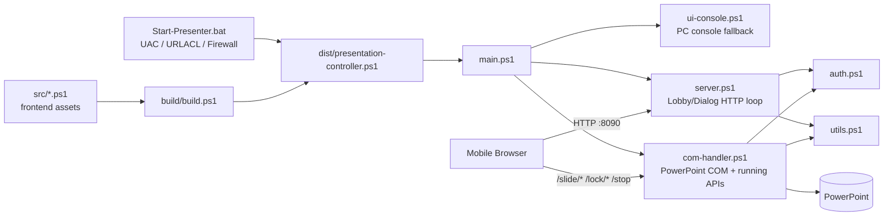

# ppt-orchestrator リファクタリング・堅牢化 最終計画書

作成日: 2026-06-30  
作成者: Sakana.ai Fugu Ultra
対象: `ppt-orchestrator`

> 本書は、`README.md` と実装一式を確認したうえで作成した、今後の改良・リファクタリング・堅牢化のための最終計画書です。  
> この作業では製品コードは変更していません。計画書のみを作成・整理しています。  
> 調査環境は macOS のため、PowerPoint COM / Windows `HttpListener` / Console / `.bat` / Firewall / URLACL の実挙動は未検証です。これらに触れる変更は、CI に加えて Windows 実機スモークを必須ゲートにします。

---

## 1. 確認範囲

以下を確認済みです。

- `README.md`
- `docs/00_ai_context.txt`
- `docs/01_characterization_spec.txt`
- `docs/02_review_checklist.txt`
- `src/config.ps1`
- `src/templates.ps1`
- `src/utils.ps1`
- `src/auth.ps1`
- `src/server.ps1`
- `src/ui-console.ps1`
- `src/com-handler.ps1`
- `src/main.ps1`
- `src/frontend/views/*.html`
- `src/frontend/js/*.js`
- `src/frontend/css/main.css`
- `build/build.ps1`
- `tests/*.ps1`
- `.github/workflows/build.yml`
- `Start-Presenter.bat`

検証として以下を実行済みです。

- `pwsh -NoProfile -File ./tests/run-tests.ps1`
- 結果: `PASS: 29 / FAIL: 0 / PENDING: 10`
- PENDING は `golden.route.tests.ps1` の 10 件のみです。`golden.cid.tests.ps1` と `golden.pin.tests.ps1` は既に実 `src` 関数へ AST 抽出で結線済みです。

---

## 2. README から確認した役割・開発背景

`ppt-orchestrator` は、外部ソフトを導入できない厳格な Windows 環境で、PowerPoint をスマホ・タブレットのブラウザから操作する **Zero-Dependency Web リモコン**です。

背景として、会社・学校・イベント会場で発生しがちな以下の問題を解決するために作られています。

- 複数登壇者のスライド切替で、担当者の負荷とミスが大きい。
- 社内 PC では Node.js / Python / 外部アプリ / 外部モジュールを入れられない。
- 会場 Wi-Fi が不安定でも、投影中の PowerPoint は止めたくない。
- 公開 Wi-Fi 上で誰でもリモコンへアクセスできる状態は避けたい。
- ファイル切替時に Explorer やデスクトップを観客へ見せたくない。
- 誤クリック・誤終了・誤ファイル選択をできるだけ防ぎたい。

実装の特徴は以下です。

- Windows PowerShell 5.1 標準機能を前提にする。
- `.NET HttpListener` と PowerPoint COM を利用する。
- Win32 P/Invoke は Console 制御や JobObject など必要箇所に限定する。
- フロントエンドは Vanilla HTML / CSS / JavaScript のみ。
- `src/` を分割開発し、`build/build.ps1` で単一 `dist/presentation-controller.ps1` に統合する。
- `Start-Presenter.bat` が管理者昇格、URLACL、Firewall 設定、cleanup を担当する。

---

## 3. 絶対制約・退行禁止事項

### 3.1 Zero-Dependency

以下は追加しない方針を維持します。

- 外部 CSS / JS フレームワーク
- PowerShell 外部モジュール
- Node.js / Python / 追加ランタイム
- PowerPoint PIA など、標準 Windows + Office 以外の製品依存

CI 上だけで使い、製品 `dist/` に同梱しない検証ツールは例外的に許容できます。

### 3.2 触っても退行させてはいけない実装

以下は既に堅牢化済みの重要実装です。変更する場合は、原則として characterization-first で挙動を固定してから、挙動不変の抽出または明示的な仕様変更として扱います。

- HResult ベースの COM 過渡エラー分類
- JobObject による PowerPoint 道連れ kill
- Console Close ボタン無効化 / QuickEdit 無効化
- `New-SecurePin` の rejection sampling
- `Protect-StateAcl` による状態ファイル ACL ハードニング
- Cookie `SameSite=Strict`
- 認証成功時の 302 リダイレクトフロー
- 800ms デバウンス
- コンソールループ先頭のキーバッファクリア
- 再生終了で操作権ロックをスコープ破棄する安全リセット
- ファイル名・デッキ名・cid 等の実行時 `HtmlEncode`
- テンプレート `-f` 全廃と `.Replace()` 方針

---

## 4. 現行アーキテクチャ



### 4.1 モジュール責務

| ファイル | 主な責務 |
|---|---|
| `Start-Presenter.bat` | 管理者昇格、URLACL 登録、Firewall rule 追加、PowerShell 起動、終了時 cleanup |
| `build/build.ps1` | `src/*.ps1` 結合、`src/frontend/**` の `%%BUILD_*%%` トークン注入、`dist/` 生成 |
| `config.ps1` | パラメータ、Win32 `Add-Type`、PIN/Token 生成、状態ファイル保存、ACL hardening |
| `templates.ps1` | ビルド時トークンを含む HTML テンプレート保持 |
| `utils.ps1` | IP 列挙、PPT ファイル列挙、finish 移動、HTTP 応答、body 読み取り、cid/PIN 抽出 |
| `auth.ps1` | Cookie 認証、PIN 認証、失敗時 throttle |
| `server.ps1` | Lobby/Dialog 中の HTTP routing と action 確定 |
| `ui-console.ps1` | Console UI、キーボード操作、Web loop 統合 |
| `com-handler.ps1` | 再生中 API、PowerPoint COM 操作、操作権 lock、スライド状態監視 |
| `main.ps1` | 起動、管理者確認、listener、PowerPoint 起動/復旧、メインループ |
| `src/frontend/**` | Auth / Lobby / NowPlaying / Dialog UI、polling、長押し、remote 操作 |
| `tests/**` | Pester 非依存の characterization tests |

---

## 5. 横断レビュー結果

### 5.1 フロントエンド

良い点:

- Vanilla JS/CSS のみで Zero-Dependency を維持している。
- `src/frontend/views` / `js` / `css` に分離済みで、build 時に単一 PS1 へ統合できる。
- 長押し確定 UI により、誤操作防止の思想が一貫している。
- `polling.js` のオフライン overlay と指数バックオフは、会場 Wi-Fi 瞬断対策として有効。
- `hold.js` への長押し処理集約が進んでいる。
- デッキ名等の動的値は PowerShell 側で `HtmlEncode` されている。

改善候補:

| 観点 | 内容 | 優先 |
|---|---|---|
| 二重ポーリング | NowPlaying で `remote.js` の `/slide/state` 1.2s polling と `polling.js` の `/status` 1.5s polling が併走している。端末数増加時に単一スレッド server の負荷源になりやすい。 | P2 |
| DOM null guard | `remote.js` は NowPlaying 専用前提が強く、テンプレート変更時に要素未存在で落ちやすい。主要要素の guard を追加する。 | P2 |
| 古いモバイル互換性 | `NodeList.forEach`, `crypto.randomUUID`, `Wake Lock`, `ResizeObserver`, Web Animations 等は fallback を持つ箇所もあるが、対象端末を決めて互換性棚卸しを行う。 | P2 |
| 長押し定数散在 | `data-hold="1500"`, `2000` 等が HTML に散在。意味単位の定数化または設計メモ化を検討。 | P2 |
| CSP 下地 | `Auth.html` に inline `onclick` があるため厳格 CSP はすぐには難しい。まず `addEventListener` 化し、将来 CSP の下地を作る。 | P2 |
| `/stop` UI | `/stop` の権限モデル変更に合わせて、Stop ボタンの有効/無効・長押し条件を UI と server で一致させる。 | P1 |

### 5.2 バックエンド / PowerPoint COM

良い点:

- COM 過渡エラーを HResult で分類しており、OS 言語に依存しにくい。
- PowerPoint 起動失敗・死活監視・自動復旧が考慮されている。
- 自分が起動した PowerPoint だけを JobObject へ紐付け、既存 PowerPoint を巻き込まない設計がある。
- `Get-SafeContextAsync` と broken pipe 握りつぶしで、クライアント切断に強い。
- 再生セッション単位で lock 状態を破棄する安全側設計がある。

改善候補:

| 観点 | 内容 | 優先 |
|---|---|---|
| 巨大関数 | `Watch-RunningPresentation` が認証、routing、COM 操作、状態管理、JSON 応答を一手に持つ。段階的に helper 抽出する。 | P1 |
| Console/Web 統合 | `Get-UserAction` が console 描画、キー入力、Web 処理、shutdown 状態を抱える。Lobby/Dialog model と loop を分ける。 | P1〜P2 |
| COM 状態取得重複 | `pos` / `total` / `atEnd` 取得が `/slide/state` と `/slide/*` 後処理で重複する。`Get-SlideRuntimeState` 化を検討。 | P2 |
| PIA 型参照 | `main.ps1` の `$pptApp.Visible = [Microsoft.Office.Core.MsoTriState]::msoTrue` は PIA 型参照に見える。一方 `DisplayAlerts` は数値。Zero-Dependency 方針なら数値化を検討。 | P1 |
| 単一スレッド逐次処理 | `$script:ContextTask` 1 個を `.Wait(100)` で処理する単線 loop。遅い client や COM block が全体を待たせる。並列化は COM STA と競合し高リスクなので、まず制約として明文化する。 | 記録/P2 |
| 空 `catch {}` | `$ErrorActionPreference='Stop'` と広範な空 catch が混在。握りつぶし箇所の棚卸しと最小ログ化を行う。 | P2 |

### 5.3 HTTP API

現行 API:

| 状態 | Endpoint | 用途 |
|---|---|---|
| 共通 | `GET /status` | polling 用状態確認 |
| 認証 | `POST /auth` | PIN 認証、Cookie 発行 |
| Lobby/Dialog | `POST /start`, `/next`, `/retry`, `/lobby`, `/exit`, `/select` | デッキ開始・次へ・再試行・戻る・終了・選択 |
| 再生中 | `GET /elapsed` | 経過時間 |
| 再生中 | `GET /slide/state` | スライド位置、総数、lock、暗転/白画面、atEnd |
| 再生中 | `POST /lock/on`, `/lock/steal`, `/lock/off` | 操作権 lock |
| 再生中 | `POST /slide/next`, `/prev`, `/first`, `/last`, `/blackout`, `/whiteout` | スライド操作 |
| 再生中 | `POST /stop` | 再生停止 |

改善候補:

| 観点 | 内容 | 優先 |
|---|---|---|
| route 分類未抽出 | `server.ps1` と `com-handler.ps1` に分岐が散在。`Resolve-Route` を純粋関数として抽出し、`golden.route.tests.ps1` を有効化する。 | P1 |
| 認証処理重複 | 未認証 HTML 応答、XHR 401 JSON、`/auth` POST、認証済み `/auth` redirect が複数箇所にある。middleware/helper 化する。 | P1 |
| 未認証 `GET /auth` | 未認証 `GET /auth` が AuthView ではなく Lobby/NowPlaying HTML に落ちる可能性がある。ファイル名・デッキ名露出につながる。 | P1 |
| `/stop` 所有権 | `/slide/*` は cid + owner を要求するが、`/stop` は認証済みなら実行可能。高影響操作として lock owner 必須にするか、緊急停止として仕様化するか判断が必要。 | P1 |
| `/status` 情報露出 | `/status` は未認証で `waiting` / `changing` / `stopping` / `running` を返す。offline overlay のため半意図的だが、仕様化または認証前最小化を検討。 | P2 |
| body parser | `filename=(.*)`, `pin=([0-9]{6})`, `cid=...` など正規表現中心。characterization 済み挙動を壊さず、段階的に form parser 化を検討。 | P2 |
| request size | `Read-RequestBody` は文字数上限で打ち切るが `Content-Length` 事前拒否はない。早期 413 相当を検討。 | P2 |
| API 仕様表 | method、認証要否、HTML/JSON、status code を docs 化する。 | P0〜P1 |

### 5.4 セキュリティ

良い点:

- PIN は CSPRNG + rejection sampling。
- 状態ファイルは ProgramData 配下で ACL hardening。
- Cookie は `HttpOnly; Path=/; SameSite=Strict`。
- 動的 HTML 注入値は `HtmlEncode`。
- README に HTTP 平文リスクと専用ネットワーク推奨が書かれている。
- `.bat` に `ALLOWED_REMOTE` の設定余地がある。

改善候補:

| 観点 | 内容 | 優先 |
|---|---|---|
| 未認証情報露出 | 未認証 `/auth` で Lobby/NowPlaying HTML が返る可能性を修正する。 | P1 |
| PIN brute force | IP 単位 1 秒 throttle のみ。失敗回数ベースの指数バックオフ、短時間 lockout、または global 試行レート上限を検討する。 | P1 |
| 日次・全端末共有 token | `SessionToken` は当日中同一で全端末共有。漏洩時に当日中有効。Token 短命化、再発行、logout/再認証、Cookie `Max-Age` を検討する。 | P1〜P2 |
| 定数時間比較 | PIN / token 比較が通常 `-eq`。リスクは低いが、固定時間比較 helper 化は低コスト。 | P2 |
| PIN 正規表現 | `pin=1234567` → `123456`、`xpin=123456` も一致する。既に test で固定済みのため、厳格化は別 PR で期待表も更新する。 | P2 |
| HTTP 平文 | TLS 導入は Zero-Dependency と衝突しやすい。専用 password-protected LAN 運用を前提に、README の注意を強化する。 | P2 |
| Firewall 既定 | `ALLOWED_REMOTE=Any` は利便性重視。`LocalSubnet` / CIDR 指定を推奨し、既定変更は別判断にする。 | P2 |
| Security headers | `X-Content-Type-Options: nosniff`, `X-Frame-Options: DENY`, `Referrer-Policy: no-referrer`, `Cache-Control: no-store` の統一を検討する。 | P2 |
| CSP | strict CSP は inline script/style/handler の整理後に検討する。 | P2 |
| Script tampering | 管理者昇格するため、配布物の展開先、改ざん確認、ZIP integrity を README で補強する。 | P2 |

### 5.5 ビルド / テスト / CI / 運用

良い点:

- `build.ps1` が `%%BUILD_*%%` token を明示的に注入している。
- CI が build token 残骸、template `-f`、`{{` 残骸、parse check、tests を実行する。
- `tests/_harness.ps1` は外部依存なし。
- GitHub Release 用 ZIP packaging がある。

改善候補:

| 観点 | 内容 | 優先 |
|---|---|---|
| docs drift | `docs/01_characterization_spec.txt` は cid/pin/route を pending と読めるが、実際は cid/pin が有効化済み。修正する。 | P0 |
| README 表現 | README の “One-Time PIN” は日次 PIN/Token 再利用の実装とズレる。`daily PIN/session` 等へ修正する。 | P0 |
| Windows smoke | CI は ubuntu なので COM / Listener / Console / `.bat` を検証できない。手順書と PR gate が必要。 | P1 |
| `.bat` 末尾 | `Start-Presenter.bat` 末尾に不要な ``` 行が残る。`exit /b 0` 後で実害は薄いが除去する。 | P0 |
| UPN 抽出 | `whoami /upn | find ":"` は通常 UPN を除外し fallback になりやすい。URLACL 登録ユーザーの正確性に影響する。 | P1 |
| finish 同名上書き | `Move-ToFinishIfPending` の `Move-Item -Force` は `finish/` の同名ファイルを上書きするリスクがある。 | P1 |
| finish file lock race | PowerPoint close 直後の move は file lock 解放前に失敗し得る。短い retry + backoff を追加する。 | P1 |
| 永続ログ | 重要イベントが `Write-Host` のみで事後解析できない。Zero-Dependency の追記専用ログを導入する。 | P1〜P2 |
| port 二重定義 | `.bat` の `WEB_PORT` と `config.ps1` の `$WebPort` が二重定義。単一ソース化を検討する。 | P2 |
| IP 表示 | `Get-LocalActiveIPs` の vendor 名除外は想定外 adapter に弱い。運用表示の改善余地がある。 | P2 |

---

## 6. 推奨リファクタリング方針

### 方針 A: Characterization-first

挙動変更前に必ず現行挙動を固定します。特に以下は先に test 化または仕様化します。

- `Resolve-Route`
- `/auth` 未認証 GET
- `/stop` 権限モデル
- finish 同名 collision
- finish file lock retry
- UPN 抽出
- PIN 正規表現厳格化を行う場合の期待値変更

### 方針 B: 1 PR = 1 論理変更

COM / Listener / Console / `.bat` に触れる変更は CI だけでは不十分です。PR を小さく分け、Windows 実機スモークを独立 gate にします。

### 方針 C: 純粋関数抽出を優先

副作用が少ない順に進めます。

1. docs/test 更新
2. route / parser / destination など純粋関数抽出
3. 認証 middleware / response helper
4. COM loop / Console loop の段階的分割

### 方針 D: Security と UX の衝突は仕様判断してから変更

`/stop`, token lifetime, `/status`, `ALLOWED_REMOTE` は安全性と現場 UX が衝突し得ます。先に仕様判断を明文化します。

---

## 7. フェーズ別計画

### Phase 0: ドキュメント・安全柵整備

目的: コード挙動を変えず、以後の変更を安全にする。

作業:

1. README の “One-Time PIN” を `daily PIN/session` へ修正。
2. `docs/01_characterization_spec.txt` を実テスト状態に追従させる。
3. API 仕様表を作成する。
4. Windows 実機スモーク手順を docs 化する。
5. `.bat` 末尾の不要な ``` 行を削除する。
6. ログ方針、security header 方針、token 方針を docs に記録する。

受け入れ条件:

- tests が `PASS 29 / FAIL 0 / PENDING 10` を維持。
- build と parser check が通る。
- `.bat` を触った場合は Windows 実機で起動・cleanup を確認。

優先度: P0

---

### Phase 1: Route / Request / Response の純粋関数抽出

目的: API 層の見通しを改善し、`golden.route.tests.ps1` の pending を解消する。

作業:

1. `Resolve-Route([string]$Path, [string]$Method)` を抽出。
2. `golden.route.tests.ps1` を有効化し、pending を 0 にする。
3. `Send-JsonResponse`, `Send-RedirectResponse`, `Send-AuthRequiredResponse` など response helper を検討。
4. request body / query の取り扱いを仕様化する。

注意:

- 最初の PR では挙動変更しない。
- `/status` の未認証許可はこの時点では維持し、変更するなら別 PR。
- 認証成功時 302 flow は維持。

優先度: P1

---

### Phase 2: 認証・API セキュリティ堅牢化

目的: 認証前情報露出と高影響操作の権限モデルを修正する。

作業:

1. 未認証 `GET /auth` は常に AuthView を返す。
2. 認証済み `GET /auth` は `/` へ 302 する。
3. XHR API 未認証時は JSON 401、通常画面遷移時は AuthView を返す方針を共通 helper 化する。
4. `/stop` の権限モデルを決める。
   - 案A: 操作権 owner のみ stop 可。
   - 案B: emergency stop として認証済み全員を許可し、仕様化とログ記録を行う。
5. PIN 失敗時の指数バックオフ / 短時間 lockout / global rate limit を検討する。
6. token lifetime / Cookie `Max-Age` / token rotation / logout 相当を検討する。
7. PIN / token 比較の固定時間 helper 化を検討する。
8. `/status` の未認証応答を仕様化し、必要なら最小化する。
9. `Send-HttpResponse` に低リスク security headers を統一追加する。

注意:

- PIN 正規表現厳格化は characterization 破壊なので別 PR。
- lockout は NAT や共有端末の正規利用を阻害しない設計にする。
- token 短命化は「日次 PIN を 1 日使い回す」現行 UX と衝突し得るため事前判断が必要。

優先度: P1

---

### Phase 2.5: 可観測性・ログ堅牢化

目的: ライブイベント失敗時の事後解析を可能にする。

作業:

1. `ProgramData\ppt-orchestrator\logs\` などへ追記専用ログを導入する。
2. `Write-Host` は UI 表示として残し、重要イベントだけ `Write-Log` にも送る。
3. PIN / token / Cookie はログに出さない。
4. 記録候補:
   - 起動・終了
   - listener start/stop
   - URL / port 情報
   - auth 成功/失敗の件数と IP hash または IP 最小情報
   - lock on / steal / off
   - `/stop`
   - COM transient/fatal error
   - finish 移動成功/失敗/retry
   - PowerPoint recovery
5. 空 `catch {}` を棚卸しし、必要箇所へ最小ログを追加する。

優先度: P1〜P2

---

### Phase 3: `Watch-RunningPresentation` の段階的分割

目的: 再生中 loop を小さくし、変更影響範囲を下げる。

抽出候補:

1. `Get-SlideRuntimeState`
2. `Invoke-SlideCommand`
3. `Update-RemoteLockState`
4. `Invoke-RunningApiRequest`
5. `Test-IsPresentationStillOpen`
6. `Get-PresentationWindowState`

注意:

- HResult 分類は退行禁止。
- COM 呼び出し回数・順序の変更は実機差が出るため、1 helper ずつ抽出する。
- 並列化は COM STA と競合し得るため、この Phase では行わない。

優先度: P1〜P2

---

### Phase 4: `Get-UserAction` / Console UI 分割

目的: PC console fallback を壊さず、Lobby/Dialog 処理を整理する。

抽出候補:

1. `New-LobbyViewModel`
2. `New-DialogViewModel`
3. `Render-ConsolePage`
4. `Read-ConsoleAction`
5. `Invoke-LobbyDialogWebRequest`
6. `Confirm-ConsoleExit`

注意:

- 800ms デバウンスを維持。
- キーバッファクリアを維持。
- Wi-Fi 断時の最後の fallback なので、Web UI より慎重に扱う。

優先度: P2

---

### Phase 5: ファイル移動・データ保護

目的: `finish/` 移動時のデータ消失と再出現を防ぐ。

作業:

1. `Move-Item -Force` による同名上書きを廃止する。
2. `Resolve-FinishDestination` を純粋関数として抽出する。
3. 同名 collision 時は `name (2).pptx` または timestamp suffix を採用する。
4. PowerPoint close 後の file lock 解放待ちとして短い retry + backoff を追加する。
5. `finish/` 内ファイルを再生した場合は再移動しない既存 idempotent guard を維持する。
6. collision と retry の unit test を追加する。

優先度: P1

---

### Phase 6: Launcher / Network 設定堅牢化

目的: URLACL / Firewall / port / IP 表示の信頼性を上げる。

作業:

1. `whoami /upn` 抽出ロジックを修正する。
2. URLACL 登録ユーザー決定をログに明示する。
3. `ALLOWED_REMOTE` の推奨値と例を README に拡充する。
4. `WEB_PORT` と `$WebPort` の二重定義解消を検討する。
5. Firewall / URLACL 追加失敗時の運用者向けメッセージを改善する。
6. IP 表示の adapter 除外ロジックを見直す。

注意:

- `.bat` 変更は Windows 実機スモーク必須。
- `ALLOWED_REMOTE=Any` 既定変更は接続性退行リスクがあるため別判断。

優先度: P1〜P2

---

### Phase 7: フロントエンド整理・UX 安定化

目的: 通信負荷、互換性、保守性を改善する。

作業:

1. NowPlaying の polling を整理する。
   - 有力案: `/slide/state` に running 判定を相乗りさせ、NowPlaying では `/status` polling を止める。
2. `remote.js` の DOM guard を追加する。
3. `Auth.html` の inline handler を `addEventListener` 化する。
4. 古い mobile browser 互換性を棚卸しする。
5. 長押し時間・文言・hint の意味を docs 化または定数化する。
6. `/stop` 権限モデル変更に UI を追従させる。

優先度: P2

---

## 8. 優先度付きバックログ

### P0: すぐ着手

1. README の “One-Time PIN” 表現修正。
2. `docs/01_characterization_spec.txt` の cid/pin 状態修正。
3. API 仕様表と Windows smoke checklist 追加。
4. `Start-Presenter.bat` 末尾の不要な ``` 行削除。

### P1: 堅牢化の本丸

1. `Resolve-Route` 抽出と `golden.route.tests.ps1` 有効化。
2. 未認証 `GET /auth` 情報露出修正。
3. `/stop` 権限モデル決定と実装。
4. `Move-ToFinishIfPending` の同名上書き・file lock race 対策。
5. `Start-Presenter.bat` の UPN 抽出修正。
6. Windows 実機スモークの PR gate 化。
7. 追記専用ログ導入。
8. `Watch-RunningPresentation` の段階的分割。

### P2: 中長期改善

1. NowPlaying polling 統合。
2. `Get-UserAction` 分割。
3. PIN 正規表現厳格化。
4. token lifetime / logout / fixed-time compare。
5. Security headers / CSP 下地。
6. port 単一ソース化。
7. `ALLOWED_REMOTE` 既定値見直し。
8. adapter/IP 表示改善。

---

## 9. 推奨 PR 分割

| PR | 内容 | 主な検証 |
|---|---|---|
| PR-A | README/docs 追従、API 仕様、Windows smoke checklist | tests, build |
| PR-B | `.bat` ゴミ行削除 + UPN 抽出修正 | tests, build, Windows `.bat` smoke |
| PR-C | `Resolve-Route` 抽出 + route tests 有効化 | tests, build, Windows API smoke |
| PR-D | 未認証 `/auth` 修正 | tests, build, browser auth smoke |
| PR-E | `/stop` 権限モデル修正 + UI 追従 | tests, build, Windows NowPlaying smoke |
| PR-F | finish 同名上書き回避 + lock retry + tests | tests, build, Windows file move smoke |
| PR-G | 追記専用ログ + catch 棚卸し | tests, build, manual log review |
| PR-H | `Watch-RunningPresentation` helper 抽出 1 | tests, build, full PowerPoint smoke |
| PR-I | Console loop/view model 分割 | tests, build, Windows console smoke |
| PR-J | Frontend polling / compatibility cleanup | tests, build, mobile browser smoke |

---

## 10. Windows 実機スモークチェックリスト

COM / Listener / Console / `.bat` に触れる PR では最低限以下を確認します。

1. `Start-Presenter.bat` ダブルクリックで UAC 昇格する。
2. URLACL と Firewall rule が追加される。
3. Console に PIN と Web URL が表示される。
4. スマホから `http://<host>:8090/` にアクセスできる。
5. PIN 認証成功・失敗・再入力が期待通り。
6. Lobby から pending deck を開始できる。
7. PowerPoint が全画面スライドショーで開く。
8. NowPlaying で lock on / off / steal が機能する。
9. next / prev / first / last / blackout / whiteout が機能する。
10. 最終スライド到達時に next が抑止される。
11. `/stop`、スライドショー終了、PowerPoint 手動 close の各 path で Dialog/Lobby に戻る。
12. `finish/` 移動が正しく、同名 collision で既存ファイルを消さない。
13. file lock retry が期待通り。
14. PC console の Start / Select / Page / Update Network / Retry / Lobby / Exit が動く。
15. スマホ Wi-Fi 一時 OFF でも投影が止まらず、復帰後 overlay が消える。
16. 終了時に PowerPoint、listener、URLACL、Firewall rule が cleanup される。
17. 既存の operator PowerPoint を誤って kill しない。
18. ログに秘密情報が出ない。

---

## 11. 追加テスト計画

既存 tests に加えて、純粋関数化と同時に以下を追加します。

| 対象 | テスト内容 |
|---|---|
| `Resolve-Route` | `golden.route.tests.ps1` の pending 10 件を有効化 |
| `Resolve-FinishDestination` | 同名 collision 時の destination 命名規則 |
| `Move-ToFinishIfPending` | finish 配下再生時は再移動しない、retry 失敗時の戻り値 |
| `Read-RequestBody` | `MaxChars` 境界、超過時 `''`、必要なら `Content-Length` 早期拒否 |
| auth helper | `/auth` GET/POST、未認証 HTML、XHR 401 JSON、認証済み redirect |
| security headers | `Send-HttpResponse` が header を統一付与すること |
| token helper | lifetime / rotation / fixed-time compare の性質 |

---

## 12. 不確実点・仕様判断が必要な点

- `/stop` は緊急停止として全認証済み端末に許可する意図だった可能性がある。owner 必須化の前に仕様判断が必要。
- token 短命化や logout は「日次 PIN を 1 日使い回す」現行 UX と衝突し得る。
- `/status` 最小化は offline overlay / reconnect UX に影響する。
- `ALLOWED_REMOTE=Any` は安全性では弱いが、接続性を優先した運用判断の可能性がある。
- `Visible` の PIA 型参照の実害は Windows + Office 実機で確認が必要。
- HTTP 並列化は COM STA と競合するため、別途設計レビューが必要。
- `docs/` は現行ルール上 `.gitignore` 対象のローカル専用資料である可能性が高い。Git 管理したい場合は保存場所を別途判断する。

---

## 13. 結論

`ppt-orchestrator` は、厳格な Windows 環境で PowerPoint 進行を安全に自動化するための、実用志向の Zero-Dependency ツールです。既に多くの堅牢化が入っているため、今後は「大胆な書き換え」ではなく、**characterization-first、純粋関数抽出、小さな PR、Windows 実機スモーク**を軸に進めるべきです。

推奨順序は以下です。

1. docs / README / API 仕様 / smoke checklist を現状追従する。
2. `Resolve-Route` を抽出して route pending を 0 にする。
3. 未認証 `/auth` と `/stop` 権限モデルを修正する。
4. finish 移動の同名上書き・file lock race を潰す。
5. `.bat` の UPN 抽出と運用ログを改善する。
6. `Watch-RunningPresentation` と `Get-UserAction` を段階的に分割する。
7. フロントエンドの polling / CSP 下地 / mobile 互換性を整理する。

この順序なら、Zero-Dependency と既存の堅牢化を維持しながら、フロントエンド、バックエンド、API、セキュリティ、運用の全領域を安全に改善できます。
